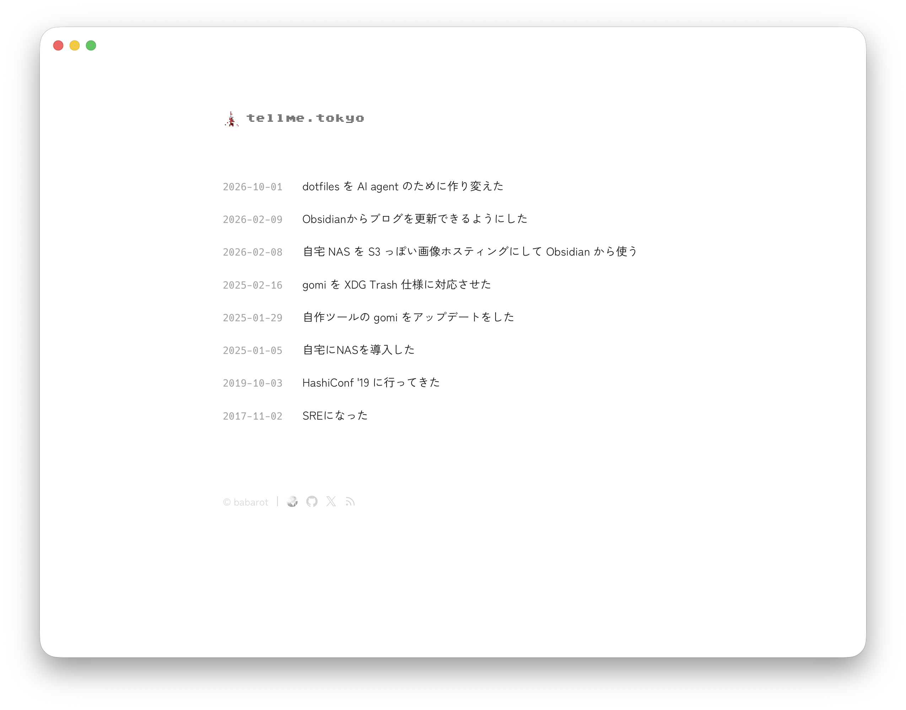

<picture>
  <source media="(prefers-color-scheme: dark)" srcset="docs/screenshots/2026-10-dark.png">
  <source media="(prefers-color-scheme: light)" srcset="docs/screenshots/2026-10-light.png">
  
</picture>

babarot's blog, at https://tellme.tokyo/. Built with [Astro](https://astro.build/) and served from Cloudflare Workers.

```sh
pnpm install
mise run dev # http://localhost:4321/
pnpm test
pnpm build   # into dist/
```

Posts are in `content/post/<year>/<slug>/`. How the site is put together, and how to write posts: [AGENTS.md](AGENTS.md).
