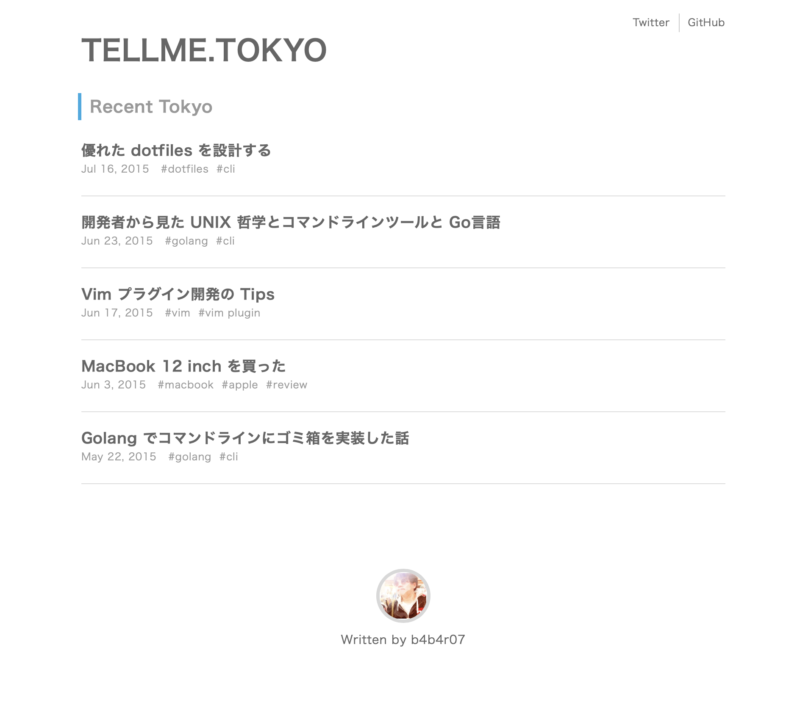
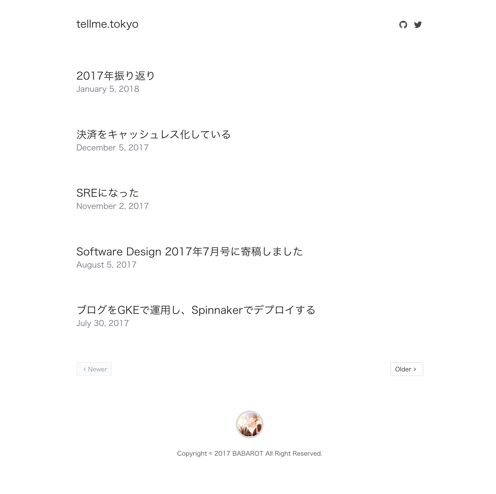
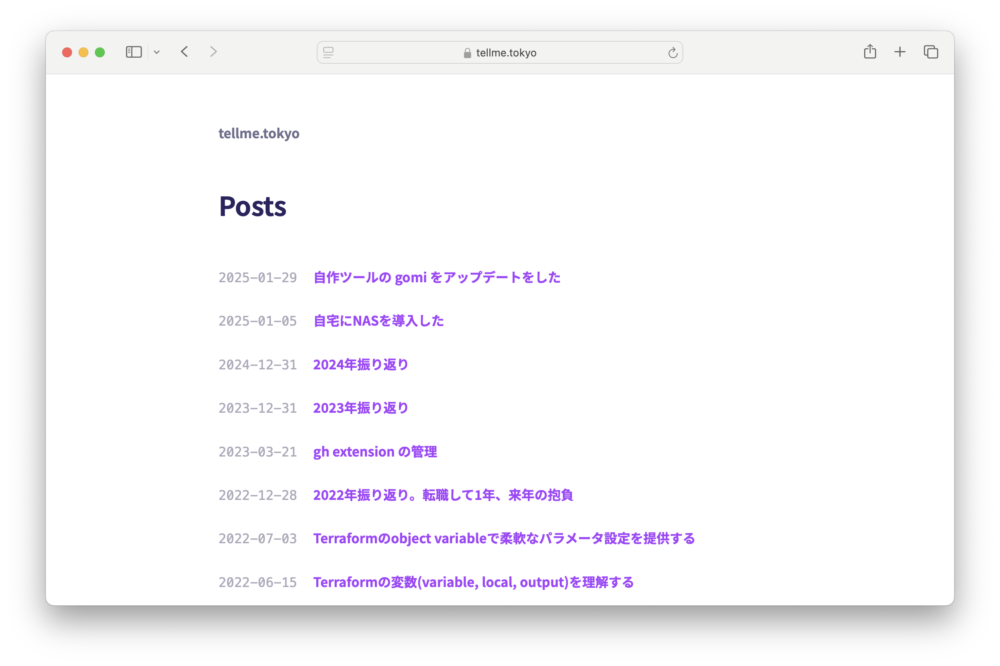
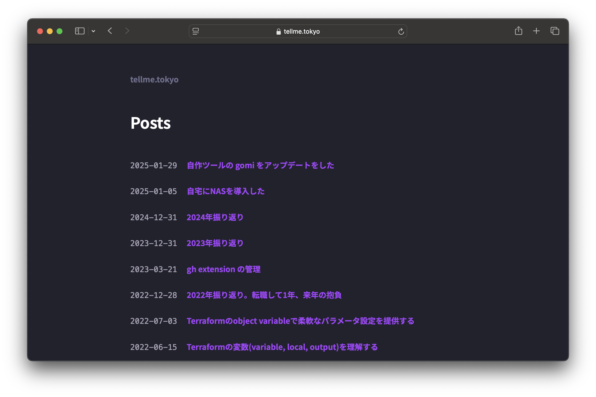
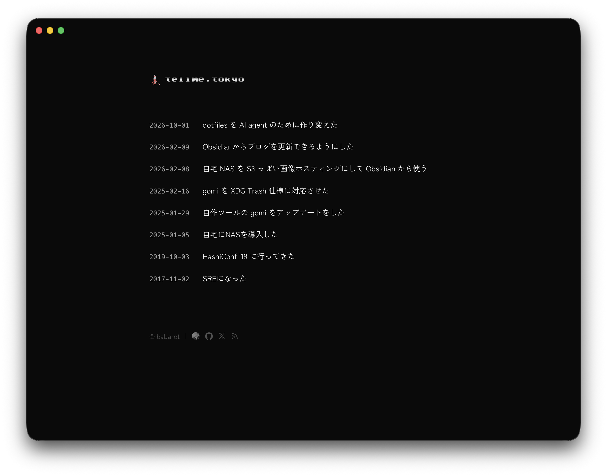

:::addendum{date=2026-10-03}
この記事を書いたあとも、tellme.tokyoは何度か作り直している。今までの流れを下の「最新の文章」にまとめ、公開したときの内容は「前の文章」に残してある。
:::

:::::revisions{view=tabs}
::::version{date=2026-10-03}
tellme.tokyoは2015年からやっている。途中でドメインごとはてなブログに移したこともあったが、また自分で作ったサイトに戻ってきた。作りも配信の仕方も何度か変わっているので、その移り変わりを残しておく。

| 時期       | 作り                         | 配信                             |
| ---------- | ---------------------------- | -------------------------------- |
| 2015年5月  | Hugoで自作                   | GitHub                           |
| 2016年9月  | はてなブログ (`www.tellme.tokyo`) | はてなブログ                     |
| 2017年7月  | Hugoで作り直し               | GKE、2017年10月からGitHub Pages  |
| 2024年12月 | Hugoのテーマをminiに替えた   | GitHub Pages、2026年2月からCloudflare Pages |
| 2026年10月 | Astroで作り直し              | Cloudflare Workers               |

## 2015年5月: Hugoで作った最初のtellme.tokyo

200X年頃からブログを書いてきたが、作っては消してを繰り返していて、そのたびに記事も消えていた。ブログがなくなっても記事はファイルとして手元に残したいと思い、HugoとGitHubで作ったのが最初のtellme.tokyo。

:::img{frame}

:::

## 2016年9月: はてなブログに移った

同じ頃、はてなブログ(`blog.b4b4r07.com`)とQiitaにも書いていて、書く場所が3つに分かれていた。1つにまとめようと思い、自作のtellme.tokyoを閉じてはてなブログに寄せた。この記事を公開したのはそのとき。合わせてはてなブログのドメインも変えた。本当は`tellme.tokyo`にしたかったが、`www.tellme.tokyo`になった。

## 2017年7月: Hugoで作り直した

2017年7月、Hugoでもう一度作り直し、tellme.tokyoに戻ってきた。今度は記事もサイトも[GitHubのリポジトリ](https://github.com/babarot/tellme.tokyo)で管理している。ちょうどGKEを触る必要があったので、最初は練習を兼ねてGKEで動かし、Spinnakerでデプロイしていた。2017年10月にはGitHub Pagesに移している。

2020年1月には、はてなブログの記事もすべてこのリポジトリに移した。はてなブログの頃の記事も、今はここで読める。

この見た目は2024年の年末まで、7年ほど続いた。

:::img{frame}

:::

## 2024年12月: テーマを替えた

2024年の年末、Hugoのテーマを自作の[mini](https://github.com/babarot/mini)に替えた。ダークモードにも対応している。2026年2月には、ホスティングをGitHub PagesからCloudflare Pagesに移した。経緯は[Obsidianからブログを更新できるようにした](/post/2026/02/09/blogging-from-obsidian/)に書いた。

:::img{scheme=light}

:::

:::img{scheme=dark}

:::

## 2026年10月: Astroで作り直した

2026年10月、HugoからAstroに作り直し、Cloudflare Workersで配信するようにした。Hugoの頃のURLはそのまま開けるか新しいURLにリダイレクトされるので、昔のリンクも切れていない。

:::img{scheme=light}

:::

:::img{scheme=dark}

:::

何度作り直しても、記事は2017年から同じリポジトリにある。記事をファイルとして手元に残すという、最初にHugoを選んだときの考えは今も変わっていない。
::::
::::version{date=2016-09-20}
200X年頃からいわゆるブログをやっておりますが、消しては作りを繰り返し、記事が残らないという残念なことをしてきました。なので、たとえブログが消えても記事がファイルとして残るように、Hugo &amp; GitHub でブログを運営していました。それが、tellme.tokyo でした。しかし、その自作ブログと、このはてなブログと、そこそこのコントリビューションがある Qiita との住み分けに辟易して、ひとつ閉じることにしました。これからは、このはてなブログ（前 blog.b4b4r07.com）に書いていくようにします。ついでにドメイン変更しました（本当は tellme.tokyo としたかったがサブドメイン www. をつけた）。
::::
:::::
