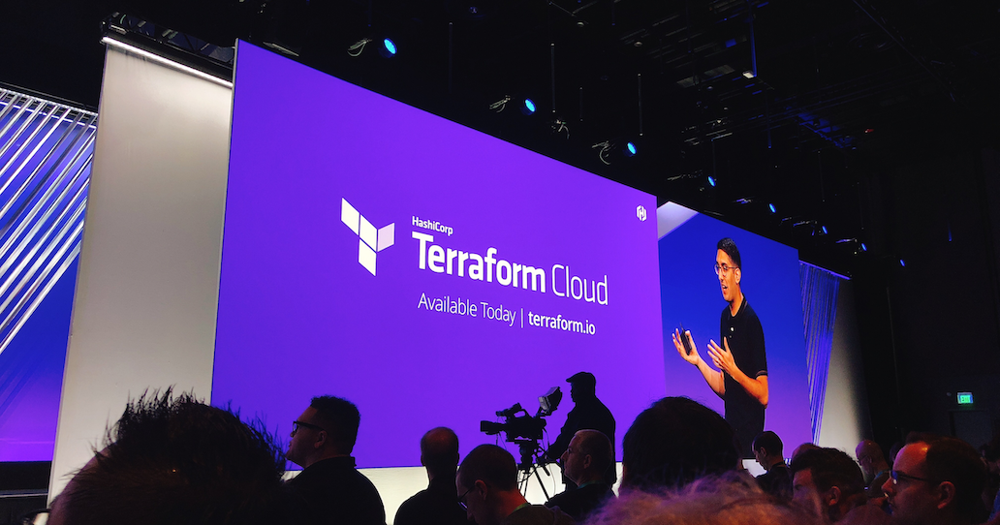
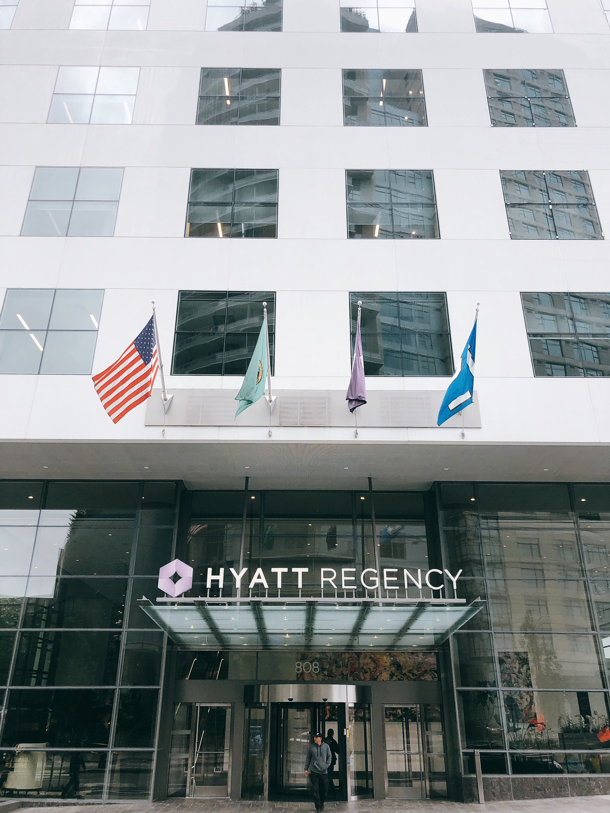
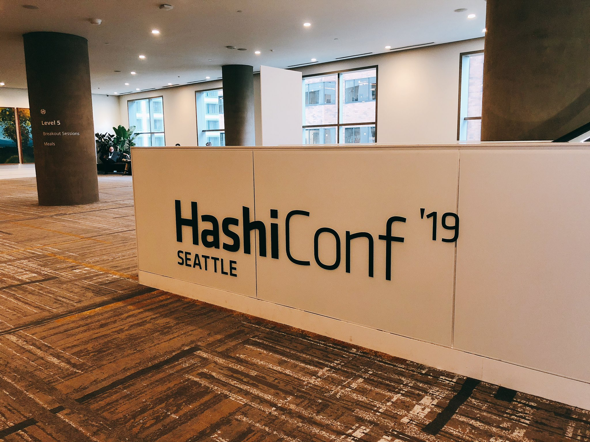
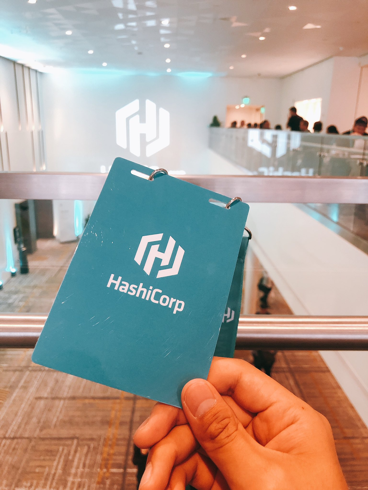
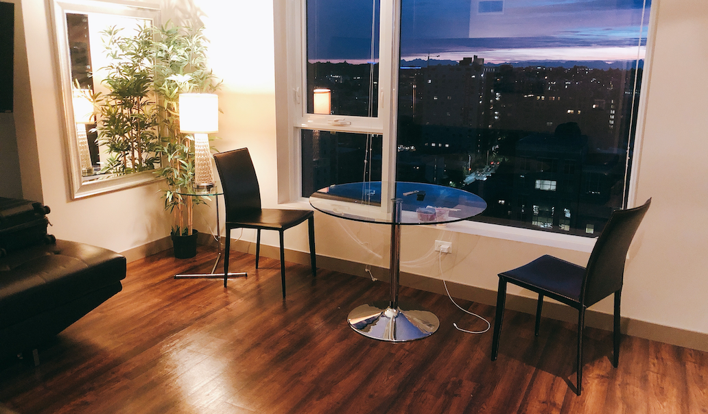

:::img{width=600}

:::

[HashiConf '19](https://hashiconf.com/)（9/9〜9/11）に行ってきた。HashiConf は、HashiCorp の製品の発表や、その製品を使って組んだアーキテクチャやノウハウを共有するカンファレンス。今年はシアトルで開かれた。

<!--
::tweet{id=1171452762116091905 user=b4b4r07}
-->

面白いキーノートはたくさんあったが、会場がいちばん沸いていたのは、やはり初日の [Armon](https://twitter.com/armon)（Co-Founder/CTO）による [Terraform Cloud](https://www.terraform.io/) の発表だったと思う。ローンチから Remote State しか扱えなかった Terraform Cloud が、ここで大きく強化され、Enterprise 版と比べても遜色ないくらいの機能になった。個人で使う分には無料なので、手軽に Terraform の環境を作りたいときに合っていると思う。

[Announcing Terraform Cloud](https://www.hashicorp.com/blog/announcing-terraform-cloud)

さらに、[Terraform Cloud / Enterprise に Cost Estimation の機能が追加された](https://www.hashicorp.com/blog/announcing-cost-estimation-for-terraform-cloud-and-enterprise)。有効にすると、「この apply でクラウドの費用がこのくらい増える（減る）」という見積もりが出るようになる。例えば、ポリシーを定義できる [HashiCorp Sentinel](https://www.hashicorp.com/sentinel/) と組み合わせて「このマイクロサービスは1000USD まで」といったポリシーを書けば、意図しないコストの増加を防げる。これはかなり便利で、この機能のためだけに Terraform Cloud を使う価値すらあると思う。

全セッションは HashiCorp の YouTube チャンネルで見られる。

https://www.youtube.com/playlist?list=PL81sUbsFNc5ZFdA6C9HZlaMKdsxtYo5wi

シアトルに行くのは初めてだった。印象はとにかく次の2つ。

- 坂が多い
- 晴れない（小雨、霧、曇り）

朝晩はかなり寒く、上着が欠かせなかった。

今回は1人だったので、あちこち食べ歩いた。中でも [Umi Sake House](https://www.umisakehouse.com/) は、新鮮な魚がおいしく、寿司のクオリティも高かった。

宿は [Cielo](https://www.berkshirecommunities.com/apartments/wa/seattle/cielo/) に泊まった。アパートメントタイプで、Airbnb のような宿。何階建てかは知らないが、泊まったのは21階で見晴らしも良かった。会場まではまっすぐ歩いて8〜10分。ただ、この時期のシアトルはやはりとても寒かった。

:::gallery{minRows=2}

:::

<iframe src="https://www.google.com/maps/embed?pb=!1m18!1m12!1m3!1d2689.8440658912423!2d-122.33170618436932!3d47.609721679184844!2m3!1f0!2f0!3f0!3m2!1i1024!2i768!4f13.1!3m3!1m2!1s0x54906ab5d0ed2ac7%3A0xc4e458c75a4728a7!2sCielo!5e0!3m2!1sja!2sjp!4v1570093520291!5m2!1sja!2sjp" width="400" height="300" frameborder="0" style="border:0;" allowfullscreen=""></iframe>

カンファレンスに参加する費用は、会社の福利厚生で出してもらえた。とてもありがたい。
