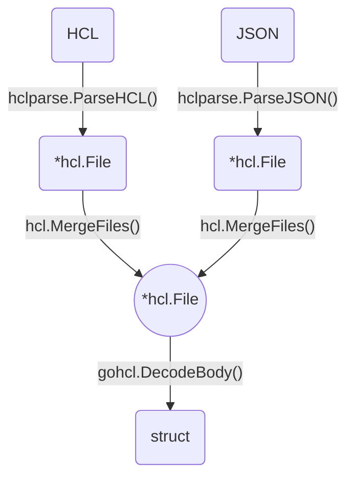
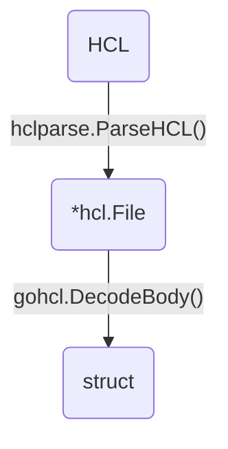

## HCL2 とは

HCL (HashiCorp Configuration Language) は HashiCorp によって作られた設定言語です。
HCL の目的はコマンドラインツールで使用するために、人間からも機械からも扱いやすく構成されていて、かつ特に DevOps ツールやサーバーなどを対象とした構造化構成言語であることです。

実装は [hashicorp/hcl](https://github.com/hashicorp/hcl) にあります。

実はこれの他に同時に Version 2 の実装も目下開発中のようです。

[hashicorp/hcl2: Temporary home for experimental new version of HCL](https://github.com/hashicorp/hcl2)

このリポジトリでは HCL が元から持つ iteration と補間言語 HIL を組み合わせて、任意の式をサポートする単一の構成言語を目指しているようです。
要するに、設定ファイルでありながら、演算処理や式の評価といったプログラミング言語的な要素を持ち合わせます。

ちなみに、HCL は HCL2 との互換性は保証されていないため、application から使用する場合は latest ではなく vendoring したものを参照するのが好ましいです。
また、HCL から HCL2 への移行パスは想定されていないようです。
構文の見た目上は非常に似ておりベースデザインは元実装を引き継ぎつつも、拡張された部分については全く異なるアプローチで実装されているようです。
例えば HCL2 の実装の方はより堅牢なエラー処理を可能にする機能などが盛り込まれています。
HCL2 の開発が安定したらもとのリポジトリはアーカイブされ、こちらが HCL の本実装になるようです。

ちなみに、HCL2 を含んだ HCL 全体のデザインなどは次の PDF が参考になります。

[HCL Documentation](https://media.readthedocs.org/pdf/hcl/guide/hcl.pdf)

## HCL2 の機能

JSON や YAML のパーサでは、バイト列を Go の構造体に落とし込むことで各要素を Go プログラム内から扱えるようにしています。

HCL でも同様のアプローチを取りますが、内部で中間表現として別の Go 構造体に落とし込んでいます。
具体的に Decode (HCL ファイルから Go 構造体に落とし込む) までの流れを見てみます。



HCL は JSON と互換性を持つので、hcl2 は両ファイル形式をサポートします。
HCL が読み込まれると [`hclparse.ParseHCL()`](https://godoc.org/github.com/hashicorp/hcl2/hclparse#Parser.ParseHCL) によって [*hcl.File](https://godoc.org/github.com/hashicorp/hcl2/hcl#File) に変換されます。
HCL はその特性上ファイル分割されていても一つにマージして内部で扱うことができます (`terraform plan` するときにカレントディレクトリ内の `*.tf` ファイルが対象となって実行されるイメージ)。

[`hcl.MergeFiles()`](https://godoc.org/github.com/hashicorp/hcl2/hcl#MergeFiles) によって複数の *hcl.File をマージして構造体に落とし込むこともできます。

そのあと、実際にデコード処理の部分として、[`gohcl.DecodeBody()`](https://godoc.org/github.com/hashicorp/hcl2/gohcl#DecodeBody) を使って任意の構造体に変換できます。

ここからが hcl2 の面白い部分の一つです。中間表現をもつことで、デコード前にいろいろな処理を挟むことができるようになっています。
そのひとつに [hcl.EvalContext](https://godoc.org/github.com/hashicorp/hcl2/hcl#EvalContext) があります。

```go
type EvalContext struct {
	Variables map[string]cty.Value
	Functions map[string]function.Function
	parent    *EvalContext
}
```

hcl.EvalContext は変数マップと関数マップを定義した構造体になっていて、`gohcl.DecodeBody()` にわたすことができます。
これによって任意の文字列をデコードのときにスキーマ側で定義済みの変数、もしくは関数として展開することができます。
つまり以下のようなコンテキスト情報をもとに、デコードのときに文字列 ("upper" など) を置換して map の value として評価することができます。

```go
ctx := &hcl.EvalContext{
	Variables: map[string]cty.Value{
		"name": cty.StringVal("Ermintrude"),
	},
	Functions: map[string]function.Function{
		"upper":  stdlib.UpperFunc,
		"lower":  stdlib.LowerFunc,
		"min":    stdlib.MinFunc,
		"max":    stdlib.MaxFunc,
		"strlen": stdlib.StrlenFunc,
		"substr": stdlib.SubstrFunc,
	},
}
```

```hcl
message = "HELLO, ${upper(name)}!"
# ==> "HELLO, ERMINTRUDE!"
```

Terraform ユーザは分かると思いますが、Terraform の tf ファイルでさまざまな組み込み関数がサポートされているのもこの機能によって実現されています。

- [Interpolation Syntax](https://www.terraform.io/docs/configuration/interpolation.html)
- [lang/functions.go - hashicorp/terraform](https://github.com/hashicorp/terraform/blob/master/lang/functions.go)

```hcl
resource "aws_instance" "app" {
  count = "3"
  private_ip = "${lookup(var.instance_ips, count.index)}"
  # ...
}
```

Terraform では [lookup](https://www.terraform.io/docs/configuration/interpolation.html#lookup-map-key-default-) などが Terraform が提供する組み込み関数として定義されており、デコードする前に、つまりスキーマに対応する構造体などに変換される前にこれらがコンテキストとして渡されて評価されるため、実際には以下のような Go 関数が実行されるので、lookup があたかも関数であるかのように HCL ファイル内で作用させることができます。

```go
var LookupFunc = function.New(&function.Spec{
	Params: []function.Parameter{
		...
	},
	VarParam: &function.Parameter{
		...
	},
	Type: func(args []cty.Value) (ret cty.Type, err error) {
		...
	},
	Impl: func(args []cty.Value, retType cty.Type) (ret cty.Value, err error) {
		...
	},
})
```

これ以外にも面白い機能がたくさんあります。

[hcl2/guide at master · hashicorp/hcl2](https://github.com/hashicorp/hcl2/tree/master/guide)

これについては公式リポジトリの guide ディレクトリ以下のドキュメントが参考になります。

## DSL を定義する

本記事のタイトルにもある通り HCL ベースの独自 DSL をつくりましょう。

上で書いたとおり、HCL2 では任意の関数などを定義した上で独自の DSL を定義できます。
具体例をあげると、Terraform の [resource](https://www.terraform.io/docs/configuration/resources.html) ブロックのような感じで独自のスキーマを定義した上で、任意の変数・関数を組み込みとして提供する DSL を自身のプロダクトの設定ファイルに持ち込むことができます。

これは結構すごいことだと思うんです。

例えば、rule というスキーマを定義したとします。
あとはそのスキーマを含めて提供する DSL の中で必要な関数や変数をデザインしてコンテキストとして織り込むだけで、拡張可能な設定ファイルを作り上げることができます。

```hcl
rule "replicas" {
  description = "Check the number of replicas is sufficient"

  conditions = [
    "${jsonpath(".spec.replicas") > 3}",
  ]

  report {
    level   = "ERROR"
    message = "Too few replicas"
  }
}
```

上の例では、jsonpath を取得する関数を定義しています。

ここからは実際の例を見ていきます。
stein という YAML ファイルなどの設定ファイル言語に対して任意のルールセットによってテストするツールで用いられている HCL ベースの DSL を例に説明していきます。

[b4b4r07/stein: A linter for config files with a customizable rule set](https://github.com/b4b4r07/stein/)

上で述べたように、*hcl.File での中間表現を経由して構造体に落とし込まれる過程を次のように表します。



まずはじめに、`hclparse.ParseHCL()` の部分です。
ソースコードからスキーマの定義を見ていきましょう。スキーマは HCL を *hcl.File にパースする際に使用します。
このレイヤーでは "DSL レベル" でのバリデーションを設けることができます。
例えば、「config ブロックは label (ブロック横の名付け) を取らない」や「rule ブロック内の report ブロックの level 属性は必須項目である」など。
これに違反した場合、hcl.Diagnostic としてレポートすることができます。

```go
var policySchema = &hcl.BodySchema{
	Blocks: []hcl.BlockHeaderSchema{
		{
			Type:       "rule",
			LabelNames: []string{"name"},
		},
		{
			Type: "config",
		},
		{
			Type:       "function",
			LabelNames: []string{"name"},
		},
		{
			Type:       "variable",
			LabelNames: []string{"name"},
		},
	},
}
```

次に、`gohcl.DecodeBody()` の部分です。

スキーマをもとに `hclparse.ParseHCL()` によってパースされた HCL は *hcl.File になります。

```go
// https://github.com/b4b4r07/stein/blob/fc9549f9db0f982f2756ef97a643ca9394de337e/lint/lint.go#L112-L117
ctx, diags := l.policy.BuildContext(l.body, file.Path, file.Data)
if diags.HasErrors() {
	return policy, diags
}

decodeDiags := gohcl.DecodeBody(l.body, ctx, &policy)
```

*hcl.File は hcl.EvalContext とともに `gohcl.DecodeBody()` によって Policy (`&policy`) 構造体にデコードされます。

ここのレイヤーでもバリデーションが実施されます。
他のパーサでいう Marshal/Unmarshal に相当する部分です。

```go
// https://github.com/b4b4r07/stein/blob/fc9549f9db0f982f2756ef97a643ca9394de337e/lint/policy.go#L10-L18
type Policy struct {
	Config  *Config  `hcl:"config,block"`
	Rules   Rules    `hcl:"rule,block"`

	Remain hcl.Body `hcl:",remain"`
}
```

この Policy 構造体が実際に Go プログラム内で扱うものになります。JSON/YAML などで使う struct tag でバインドの設定をしていきます。

ちなみに、optional の tag もありますが、block と併用する場合ポインタにして nil として扱う必要があります。

- [Added struct tag optional for gohcl by nicholasjackson · Pull Request #13 · hashicorp/hcl2](https://github.com/hashicorp/hcl2/pull/13)
- [gohcl and optional attributes · Issue #24 · hashicorp/hcl2](https://github.com/hashicorp/hcl2/issues/24)

これらの流れを踏まえて stein では、

```console
$ tree -d ./lint
lint/
├── args.go
├── lint.go                  <---- (2) gohcl.DecodeBody() の実行
├── policy.go                <---- * decode される構造体の定義
└── internal/
     └── policy/
          ├── funcs/
          ├── loader/        <---- (1) HCL を読み込む
          ├── terraform/
          ├── config.go
          ├── context.go
          ├── policy.go      <---- * スキーマの定義
          ├── rule.go
          └── variable.go
```

という形でパッケージングしています。

## まとめ

本記事では hashicorp/hcl2 パッケージを紹介するとともに以下の点に焦点をあてて取り上げました。

- 独自のスキーマを定義、それをもとにパースしバリデーション違反を Diagnostic としてレポートできる
- EvalContext によって組み込み提供する変数、関数を実装できる

HCL での設定において、hcl2 を用いてスキーマ定義・言語拡張を行うことで Terraform のような幅広い表現力を手に入れることができます。

ちなみに、Diagnostic でレポートされた診断結果は hcl2 パッケージの [hcl.DiagnosticWriter](https://godoc.org/github.com/hashicorp/hcl2/hcl#DiagnosticWriter) によって以下のようにわかりやすくエラー診断を表示することができます。

```
Error: Unsupported argument

  on _examples/.policy/config.hcl line 2, in config:
   2:   foo = "test"

An argument named "foo" is not expected here.
```

もちろんこの診断結果も "DSL レベル" で実装者が定義できます。

hcl2 はまだ開発途中ですが強力な表現力を提供することが可能なので、ユーザに強く設定ファイルを書かせたい場合[^1]にはいい選択肢となると思います。

[^1]: stein はテストルールをユーザのユースケースに合わせて定義してもらい、それをもとに lint を実行するツールなので hcl2 との相性が抜群でした
