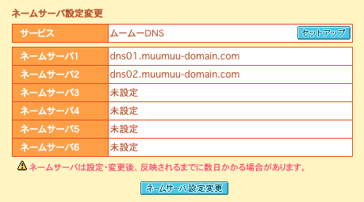
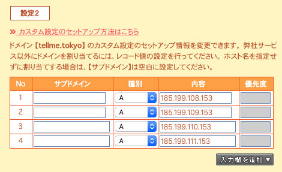
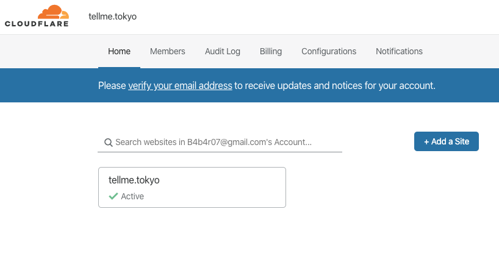
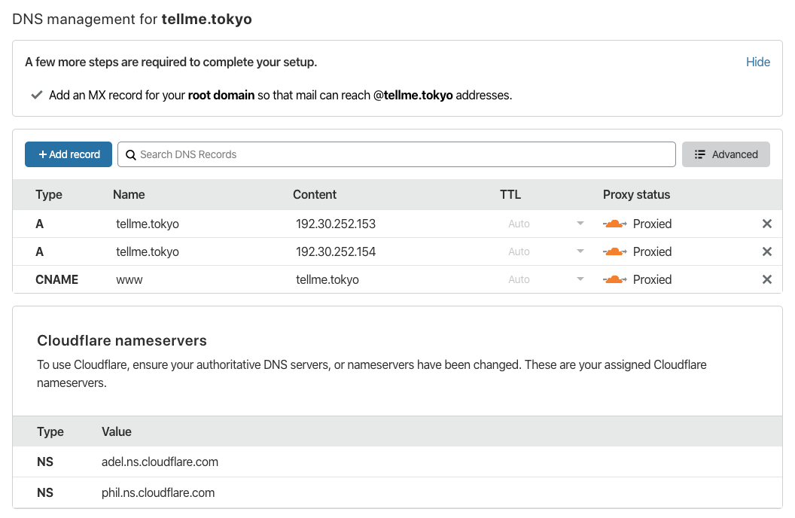
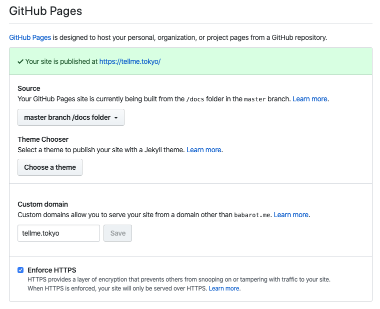

以前は GitHub Pages だけでは HTTPS 配信ができなかったので、Cloudflare をプロキシにして HTTPS 化させていた。

[カスタムドメインの GitHub Pages で HTTPS を使う - Qiita](https://qiita.com/superbrothers/items/95e5723e9bd320094537)

もう必要ないので Cloudflare を通さないようにする。

Before:

```
Domain-provider DNS -> Cloudflare DNS -> GitHub -> tellme.tokyo
```

After:

```
Domain-provider DNS -> GitHub -> tellme.tokyo
```

### 1. ドメインプロバイダの DNS 設定を Cloudflare からプロバイダ提供のものに変更する

Cloudflare DNS を使っていたのを、

:::img{width=400}

:::

ムームードメインの DNS サーバを使うようにセットアップした。

:::img{width=400}

:::

### 2. GitHub Pages への IP アドレスを A レコードに設定する

GitHub Pages に向ける。

:::img{width=400}

:::

参考: [GitHub Pages で HTTPS を有効にする | tellme.tokyo](https://tellme.tokyo/post/2020/01/20/github-pages-with-https/)

```bash
$ dig tellme.tokyo +noall +answer
```

Cloudflare ではなく GitHub が参照される。

### 3. Cloudflare を通らなくなるので設定を消す

ここらへんの設定を消す。

サイトごとに設定を持っている。

:::img{width=600}

:::

Cloudflare のコンパネから DNS のタブを選択すると、今までここを通過するような設定になっていることがわかる。

:::img{width=600}

:::

`x` して消して良い。

### 4. GitHub Pages の設定画面から `Enforce HTTPS` をする

DNS の切り替えに時間を要して接続が確立するまで Warning が出るけど放っておくと解消される。

すると `Enforce HTTPS` を押せるようになるので押したら完了。

:::img{width=600}

:::

## 参考

- [GitHub Pagesが提供するhttpsに乗り換えてみた(ﾉ´∀｀_)・Cloudflareとスピード比較してみた · hoshinotsuyoshi.com - 自由なブログだよ](https://hoshinotsuyoshi.com/post/move_to_github_pages_https/)
