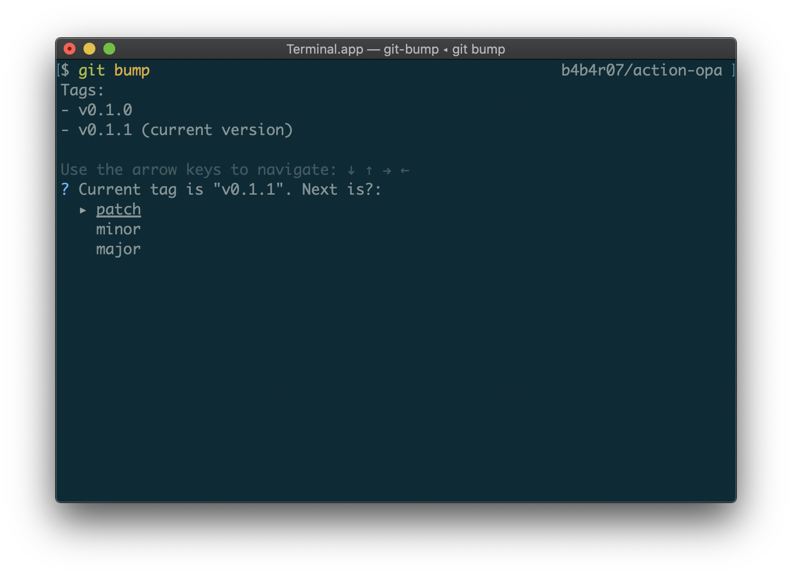

## lt;dr

[GoReleaser](https://goreleaser.com/) と [GitHub Actions](https://help.github.com/en/actions/automating-your-workflow-with-github-actions/about-github-actions) を使うと簡単にビルドしたバイナリを作ってアップロードできる。

- 2つの YAML を書いてリポジトリにコミットする
  - `.github/workflows/release.yml`
  - `.goreleaser.yml`
- git tag して push する
- バイナリがリリースされる

専用のツールをローカルにインストールする必要はない。

## 本題

前に、[Go のコマンドラインツールを簡単にリリースする | tellme.tokyo](https://tellme.tokyo/post/2019/02/15/release-go/) というブログを書いた。

それよりももっと楽になったので紹介する。

基本的にこのページで紹介する方法では 2 つの YAML をリポジトリに置くだけで終わる。
ローカルに何かをインストールする必要もない。
2 つの YAML を書くだけ (コピペするだけ) でリリースの準備が整う。

まずはじめに `.github/workflows/release.yml` を置く。
編集不要でコピペする。

```yaml
name: release
on:
  push:
    tags:
    - "v[0-9]+.[0-9]+.[0-9]+"
jobs:
  goreleaser:
    runs-on: ubuntu-latest
    steps:
      - name: Checkout
        uses: actions/checkout@v1
        with:
          fetch-depth: 1
      - name: Setup Go
        uses: actions/setup-go@v1
        with:
          go-version: 1.13
      - name: Run GoReleaser
        uses: goreleaser/goreleaser-action@v1
        with:
          version: latest
          args: release --rm-dist
        env:
          GITHUB_TOKEN: ${{ secrets.GITHUB_TOKEN }}
```

つぎに `.goreleaser.yml` を置く。このファイルはツール名の部分だけリポジトリに沿うように変更する (git-bump のところ)。

```yaml
project_name: git-bump
env:
  - GO111MODULE=on
before:
  hooks:
    - go mod tidy
builds:
  - main: .
    binary: git-bump
    ldflags:
      - -s -w
      - -X main.Version={{.Version}}
      - -X main.Revision={{.ShortCommit}}
    env:
      - CGO_ENABLED=0
archives:
  - name_template: '{{ .ProjectName }}_{{ .Os }}_{{ .Arch }}{{ if .Arm }}v{{ .Arm }}{{ end }}'
    replacements:
      darwin: darwin
      linux: linux
      windows: windows
      386: i386
      amd64: x86_64
    format_overrides:
      - goos: windows
        format: zip
release:
  prerelease: auto
```

(もし細かいパラメータの意味や出力結果の調整をしたかったら[公式ページ](https://goreleaser.com/)をみたらすぐできる)

すると、GitHub Actions の release ワークフローが走って、



こんな感じで各 OS 向けにビルドされた artifacts が [Releases](https://github.com/b4b4r07/git-bump) にアップロードされる。


ローカルに [goreleaser](https://github.com/goreleaser/goreleaser) をインストールしたりする必要もないので楽になった。

加えて、GoReleaser を使うと git tag の情報とか build commit をバイナリに埋め込むことがこれまでよりも簡単になる。

Go のコード側で埋め込み用の Variables だけを定義する。

```go
// These variables are set in build step
var (
	Version  = "unset"
	Revision = "unset"
)
```

main.go ではなく、cmd などの下や別ファイルに Version などを書いている場合は別途埋め込み先の指定を変える。

```yaml
builds:
  - main: .
    binary: gist
    ldflags: 
      - -s -w
      - -X github.com/b4b4r07/gist/cmd.Version={{.Version}}
      - -X github.com/b4b4r07/gist/cmd.BuildSHA={{.ShortCommit}}
      - -X github.com/b4b4r07/gist/cmd.BuildTag={{.Tag}}
```

今までは Makefile で ldflags の設定などをすることが多かったけど、それも GoReleaser の設定ファイルに寄せることができる。
これで Makefile を頑張って書く必要もなくなった。

この仕組みのおかげで Go で CLI ツールを書くことがもっと楽しくなったし楽になったのでバイナリをちゃんと用意することが増えた。

おかげさまで今まで以上に git tag して git push origin tag することが増えたので、

- 「あれ今このリポジトリはバージョンいくつだっけな」
- 「git tag して patch version で bump して、、」

とするのが面倒だったのでそれをするためだけの Go ツールを書いた。





いわずもがなにこれも GoReleaser + GitHub Actions でリリースしている。

(特に CLI ツールでなくとも GitHub Actions を書いてビルドするときにも便利だった)

## まとめ

GoReleaser と GitHub Actions で Go の CLI ツールのリリースでやることが減った。

個人的に GoReleaser を使っておくことで checksum のテキストを作ってくれてバイナリと一緒にアップロードしてくれるところも手間を減らせるという点で好きなポイント。

以下に実例をいくつか列挙しておく。

- https://github.com/b4b4r07/git-bump
- https://github.com/b4b4r07/gist
- https://github.com/b4b4r07/gomi
