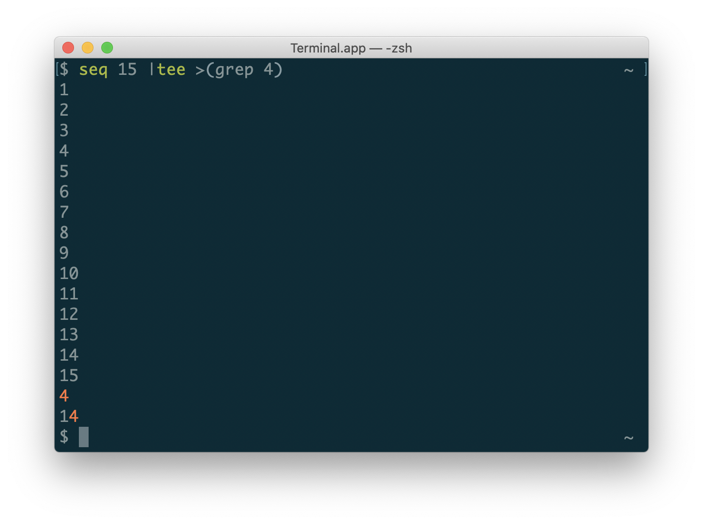

コマンドの結果を目で見ながら、パイプに渡すなどするときのこと。

よくやるのに忘れるのでメモする。

## 結論

```bash
some-command | tee >(pipe-command)
```

## 解説

[tee コマンド](http://man7.org/linux/man-pages/man1/tee.1.html)を使うとできる。

肝は tee が input されたデータを、

- 標準出力
- リダイレクト先

これらに output することができるので、リダイレクト先を[プロセス置換](https://www.tldp.org/LDP/abs/html/process-sub.html)[^1]を使ってパイプに渡したいコマンドを指定することで標準出力に出しつつ、特定のコマンドにパイプすることができる。

実際のデモ:

```bash
seq 15 | tee >(grep 4)
```



tee は標準出力ではなく、標準エラー出力にも出すことができる。
普通に file descriptor 2番に出力する。

```bash
seq 15 | tee >(grep 4) >&2
# もしくは
seq 15 | tee >&2 >(grep 4)
```

よくやるシーンとして、CI のコンソールにも出しつつ、結果を GitHub コメントに POST する、といったときにやる。

```bash
notify() {
  local comment template

  comment="$(tee >(cat) >&2)" # pipe and output stderr
  template="## Some results
\`\`\`
%s
\`\`\`
"

  comment="$(printf "${template}" "${comment}")"
  github_comment "${comment}"
}

some_output_func | notify
```

[mercari/tfnotify](https://github.com/mercari/tfnotify) も最初はこういう感じのシェルスクリプトから始まったことを思い出した。

[^1]: [コマンド置換](https://www.gnu.org/software/bash/manual/html_node/Command-Substitution.html)ではない
