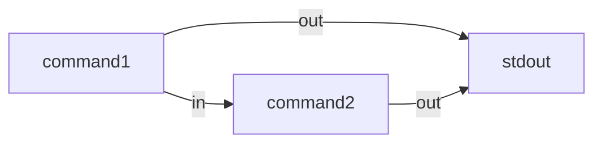

コマンドの出力をターミナル (stdout) に出しながらパイプに繋いだ別のコマンドの stdin に流すとき、どう書くか。

## 結論

```bash
command1 | tee >(command2)
```




## 解説

[tee コマンド](http://man7.org/linux/man-pages/man1/tee.1.html)を使うとできる。tee は標準入力から来たデータを標準出力とリダイレクト先にストリーム出力することができる。

そこでリダイレクト先を[プロセス置換](https://www.tldp.org/LDP/abs/html/process-sub.html) (_Process Substitution_)[^1]でパイプでつなぎたいコマンドを指定することで、標準出力に出しつつ特定のコマンドの入力に接続できる。

```bash
seq 15 | tee >(grep 4)
```

```bash
1      # seq
2      # |
3      # |
4      # |
5      # |
6      # |
7      # |
8      # |
9      # |
10     # |
11     # |
12     # |
13     # |
14     # |
15     # |
4      # grep
14     # |
```

標準出力ではなく標準エラー出力に出したい場合は次のようにする (やっていることは FD 1番を FD 2番に向けるだけ)。

```bash
seq 15 | tee >(grep 4) >&2
# Or
seq 15 | tee >&2 >(grep 4)
```


実際の利用事例として「何かしらのコマンドを実行し CI のコンソールにも出しつつ GitHub にもコメントにする」ときとかに便利。

```bash
date | tee >(gh issue comment --repo babarot/sandbox 12 --body-file -)
```


[mercari/tfnotify](https://github.com/mercari/tfnotify) も最初はこういう感じのシェルスクリプトから始まったことを思い出した。

```bash
notify() {
  local comment="$(tee >(cat) >&2)"
  local template="## Some results
\`\`\`
%s
\`\`\`
"

  comment="$(printf "${template}" "${comment}")"
  gh issue comment --repo babarot/sandbox 12 --body "${comment}"
}

do_something() { date; }

# main
do_something | notify
```



[^1]: [コマンド置換](https://www.gnu.org/software/bash/manual/html_node/Command-Substitution.html)ではない
