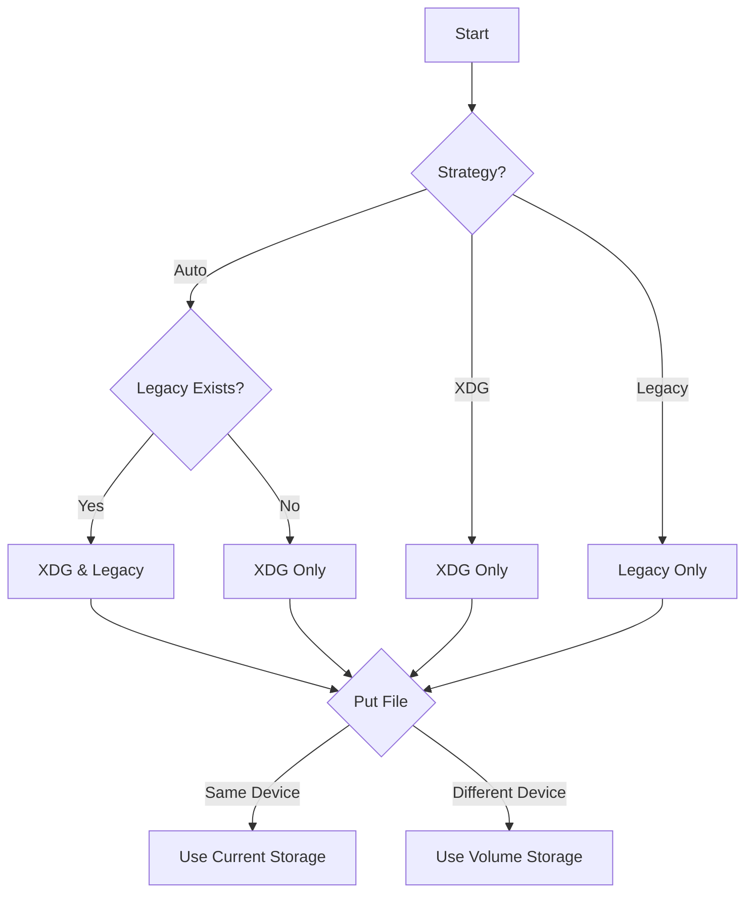

前回、[gomi](https://gomi.dev) という CLI ゴミ箱ツールを Bubble Tea ベースの UI に置き換えた[^gomi-tea]という記事を書いたが、あのあとスターが 50 くらい増えて Issue もいくつか Open された。
その中であったのが今回のブログ記事の話である XDG Trash に準拠してほしい[^issue]というものだ。

[^gomi-tea]: https://tellme.tokyo/post/2025/01/29/gomi/
[^issue]: https://github.com/babarot/gomi/issues/59

XDG Trash とは [XDG Trash Specification](https://specifications.freedesktop.org/trash-spec/latest/) のことで、Linux デスクトップ環境間での標準化を進める組織・プロジェクトの [Freedesktop.org](https://www.freedesktop.org/wiki/) によって策定されたものだ。
Linux の場合、デスクトップ環境が統一されていないため、ゴミ箱について OS としての統一の API はなく、かわりに各デスクトップ環境で共通化するための仕様があるというわけだ。
Freedesktop.org ではゴミ箱に限らず XDG (Cross-Desktop Group) 仕様を策定し、デスクトップ環境の互換性を向上させるためのガイドラインを提供している。

今回の記事では、XDG Trash とは具体的にどんな仕様であり、どうやって gomi をそれに対応させたのかを書いてみる。


## XDG Trash とは

XDG Trash Specification は、Freedesktop.org によって定義されたゴミ箱の標準仕様である。Linux や *nix 系 OS で統一されたゴミ箱管理を実現し、異なるデスクトップ環境やツール（`gio trash`、`trash-cli` など）間での互換性を確保するために設計されている。
この仕様に準拠することで、アプリケーションは共通のゴミ箱管理を行うことができ、ユーザーが異なるツールを使っても一貫した動作が保証される。

XDG Trash は、各ストレージ（ボリューム）ごとに Trash ディレクトリを作成し、以下の2つのサブディレクトリをもつ。

```bash
~/.local/share/Trash/       # ユーザーのホームディレクトリのゴミ箱
├── files/                  # 削除されたファイル本体
└── info/                   # ファイルごとのメタデータ（削除日時や元のパス）
```

- **files/**
  削除されたファイル本体が保存される。ファイル名は変更されず、そのままの名前で保存される。
- **info/**
  各ファイルには `.trashinfo` という拡張子のメタデータファイルが作成され、削除日時や元の保存場所が記録される。

例: `test.txt` を削除した場合の `.trashinfo` ファイル

```bash
[Trash Info]
Path=/home/user/Documents/test.txt     # 元のファイルパス
DeletionDate=2025-02-16T12:34:56       # 削除日時（ISO 8601 形式）
```

この情報をもとに、削除されたファイルを元の場所に戻すというわけだ。

さらに XDG Trash の仕様では、ゴミ箱は ボリューム（ストレージ）ごとに作成される。
USB メモリや外付け HDD などのリムーバブルストレージには、ルートディレクトリに .Trash-$UID/ というディレクトリが作成され、そこに files/ や info/ を配置する。

例: /mnt/usbdrive/ にある XDG Trash


```bash
/mnt/usbdrive/.Trash-1000/  # ユーザーID 1000 のゴミ箱
├── files/
└── info/
```

## gomi の XDG Trash 対応

XDG Trash に対応してほしいという Issue が来たとき、Linux ユーザーではなかったのでモチベーションは低かった。
しかし、標準仕様に対応すれば、他の XDG Trash 準拠ツールと互換性が生まれ、ユーザーが簡単に乗り換えできるようになる。そこで対応を決めた。

XDG Trash に対応するなら、ゴミ箱に入れたいファイルを ~/.local/share/Trash の files/ に移動して info/ に .trashinfo を作ればいいんでしょ、と思ったがそんな単純な話ではなかった。

- **ボリュームの検知**
  - 外部ストレージがマウントされている場合、適切なゴミ箱ディレクトリに配置する必要がある。
- **クロスデバイス制約**
  - 外部ストレージではファイルシステムが異なる可能性があり、`rename(2)` が使えない。
  - そのため、コピー＆削除 (`copy-and-delete`) で移動を実現する必要がある。
- **アトミックな操作**
  - メタデータの記録とファイルの移動を 1 つのトランザクションにまとめ、整合性を保証する必要がある。
- **trashinfo 作成失敗時のフォールバック**
  - `trashinfo` を作成できなかった場合、そのファイルは元の場所に戻してエラーにするべきである。

また、gomi ではリリース当初から独自のゴミ箱ディレクトリ (~/.gomi/YYYY/MM/DD) と構造、独自のメタデータファイル (JSON) で削除したファイルを管理していた。

```bash
~/.gomi
├── history.json
├── history.json.backup
└── 2025
    └── 02
        └── 15
            ├── cumknsteq52l3im0p8gg/
            │   ├── install
            │   └── README.md
            └── cuhp02deq52mfk0ev41g/
                └── a.go
```


gomi では 9 年近くこの構造を使ってきたのでこのゴミ箱にはすでに大量のファイルが存在している。XDG Trash に準拠するにはこの仕様を変える必要があったが、この仕様ごと捨ててしまうとこれまでのゴミ箱ファイルを戻すことができなくなってしまう。そのため、うまく XDG Trash と共存させる方法はないかと考えてみることにした。

1. 既存のゴミ箱仕様を捨てる
    - 互換性を切ると、過去のファイルを戻せなくなる
2. 既存のゴミ箱から XDG Trash に移行する
    - マイグレーションスクリプトを書くのが面倒
    - ミスると既存ユーザーの環境を壊すリスクがある
    - バージョンアップでこれまでの構造のファイルが一気に移動するのは気持ち悪い
3. 既存のゴミ箱は残し読み込み専用にし、XDG Trash を使うようにする
    - 既存のユーザにも新規ユーザにも優しい
    - 実装が複雑になる

3 が良さそうだ。

さて、こうして既存の仕様を残すこと（共存させる）を選んだわけだが、そのまま実装していくと複雑化が避けられない。そこで取った策はこれだ。ゴミ箱（ストレージ）の上に一枚の抽象化レイヤを設けてファイル操作はそのインターフェイスから行う。ゴミ箱に移動する、ゴミ箱から戻す、基本的なゴミ箱操作はどちらのストレージでも共通であるため、抽象化がうまく作用する。利用側は Put() や Restore() というファンクションを呼ぶだけで、実体のあるゴミ箱の実装は隠蔽してしまう。



XDG Trash と Legacy Trash の両方を interface で定義し、Trash Manager という上位構造体を通じて操作する。

```go
type Storage interface {
    Put(src string) error
    Restore(file *File, dst string) error
    Remove(file *File) error
    List() ([]*File, error)
    Info() *StorageInfo
}
```

こうすることで、既存の構造自体は大きく変えずにインターフェイスに切り替え（追加）だけで扱えるストレージを増やすことができた。

具体的な実装は [PR](https://github.com/babarot/gomi/pull/69) を参照してほしい。

## XDG Trash に対応してみて

標準仕様に準拠したことで、他のツールとシームレスに連携できるようになったことは改めて良い体験なんだなと気づいた。

[trash-cli](https://github.com/andreafrancia/trash-cli) で消したやつを gomi で戻したり、gomi で消したやつを [gtrash](https://github.com/umlx5h/gtrash) で戻せたりする。実際はこんなに CLI ツールを行き来することはそうそうないが、標準仕様に乗っかっているということはそういうこともできるということだ。また、Linux デスクトップ環境を持っている人は GUI から戻せるのだろう。XDG Trash に対応したというだけだが、これで gomi も標準仕様に仲間入りできた。

ちなみに、XDG Trash の実装中に知ったのだが Homebrew の [Core Formula](https://formulae.brew.sh/formula/gomi) に入ることができた。誰かが追加してくれたようだ[^brew]。

```
brew install gomi
```

[^brew]: https://github.com/Homebrew/homebrew-core/pull/207022

なんとなく gomi も一人前になれた気がする。

リンク:




