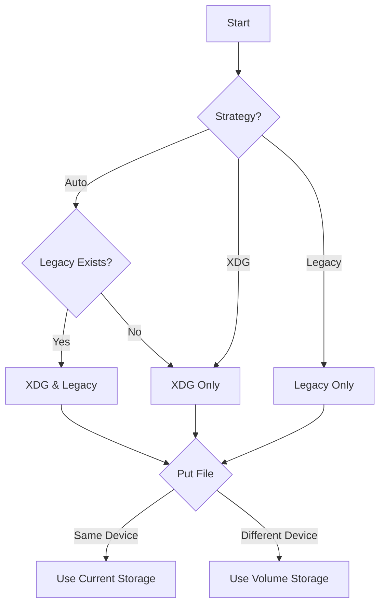

[前回](/post/2025/01/29/gomi/)、CLI のゴミ箱ツール [gomi](https://gomi.dev) の UI を Bubble Tea で書き換えた記事を書いた。そのあとスターが50ほど増え、Issue もいくつか届いた。その中の1つが、XDG Trash に準拠してほしいという[要望](https://github.com/babarot/gomi/issues/59)だった。今回はその対応の話。

XDG Trash は、[Freedesktop.org](https://www.freedesktop.org/wiki/) が定めた [XDG Trash Specification](https://specifications.freedesktop.org/trash-spec/latest/) のこと。Linux はデスクトップ環境が1つに決まっていないので、ゴミ箱について OS として統一された API がない。その代わりに、どのデスクトップ環境でも同じように扱えるよう、ゴミ箱の仕様が決められている。Freedesktop.org は Linux のデスクトップ環境どうしの互換性を高めるための組織で、ゴミ箱に限らず XDG (Cross-Desktop Group) の仕様をいくつも出している。

## XDG Trash の仕様

この仕様に沿っていれば、異なるデスクトップ環境やツール（`gio trash`、`trash-cli` など）の間で同じゴミ箱を使える。あるツールで消したファイルを、別のツールで戻せるということ。

ゴミ箱のディレクトリは、次の2つのサブディレクトリを持つ。

```bash
~/.local/share/Trash/       # ユーザーのホームディレクトリのゴミ箱
├── files/                  # 削除されたファイル本体
└── info/                   # ファイルごとのメタデータ（削除日時や元のパス）
```

- `files/`: 削除されたファイル本体が、名前を変えずにそのまま置かれる
- `info/`: ファイルごとに `.trashinfo` という拡張子のメタデータファイルが作られ、削除日時と元の場所が記録される

例えば `test.txt` を削除すると、`.trashinfo` はこうなる。

```bash
[Trash Info]
Path=/home/user/Documents/test.txt     # 元のファイルパス
DeletionDate=2025-02-16T12:34:56       # 削除日時（ISO 8601 形式）
```

この情報をもとに、削除されたファイルを元の場所に戻すというわけ。

さらに、ゴミ箱はボリューム（ストレージ）ごとに作られる。USB メモリや外付け HDD のようなリムーバブルストレージでは、そのルートに `.Trash-$UID/` というディレクトリを作り、その下に `files/` と `info/` を置く。`/mnt/usbdrive/` の場合はこうなる。

```bash
/mnt/usbdrive/.Trash-1000/  # ユーザーID 1000 のゴミ箱
├── files/
└── info/
```

## gomi を XDG Trash に対応させる

正直に言うと、XDG Trash に対応してほしいという Issue が来たとき、自分は Linux ユーザーではなかったのでモチベーションは低かった。ただ、標準の仕様に対応すれば、ほかの XDG Trash 準拠のツールと行き来できるようになり、ユーザーも乗り換えやすくなる。そう考えて対応することにした。

ゴミ箱を `~/.local/share/Trash` にして、ファイルを `files/` に移し、`info/` に `.trashinfo` を作ればいいんでしょ、と思ったがそんな単純な話ではなかった。考えないといけないことがいくつかあった。

- ボリュームの検知: 外部ストレージがマウントされていれば、そのボリュームのゴミ箱に置く必要がある
- デバイスをまたぐ移動: 外部ストレージはファイルシステムが違うことがあり、`rename(2)` が使えない。コピーしてから削除する（copy-and-delete）形で移動する必要がある
- 操作の不可分性: メタデータの記録とファイルの移動を1つの操作として扱い、途中で失敗しても整合性が崩れないようにする必要がある
- `.trashinfo` を作れなかったとき: そのファイルは元の場所に戻し、エラーにする

加えて、gomi はリリース当初から独自のゴミ箱の構造（`~/.gomi/YYYY/MM/DD`）と、独自のメタデータファイル（JSON）で削除したファイルを管理していた。これをどう扱うかも決める必要があった。

```bash
~/.gomi
├── history.json
├── history.json.backup
└── 2025
    └── 02
        └── 15
            ├── cumknsteq52l3im0p8gg/
            │   ├── install
            │   └── README.md
            └── cuhp02deq52mfk0ev41g/
                └── a.go
```

9年近くこの構造を使ってきたので、このゴミ箱にはすでに大量のファイルがある。XDG Trash に合わせるには構造を変えないといけないが、古い構造ごと捨てると、これまでゴミ箱に入れたファイルを戻せなくなる。そこで、XDG Trash とうまく共存させる方法を考えた。案は3つあった。

1. 既存のゴミ箱の仕様を捨てる
    - 互換性がなくなり、過去のファイルを戻せなくなる
2. 既存のゴミ箱から XDG Trash に移行する
    - 移行用のスクリプトを書く手間がかかる
    - 失敗すると、既存のユーザーの環境を壊すおそれがある
    - バージョンを上げただけで、これまでのファイルが一斉に移動するのはちょっと気持ち悪い
3. 既存のゴミ箱は読み込み専用で残し、新しく消すファイルは XDG Trash に入れる
    - 既存のユーザーにも新しいユーザーにも優しい
    - 実装は複雑になる

この中だと3が一番良さそうだったので、その方針で実装することにした。

ただ、2つのゴミ箱を共存させたまま素直に書いていくと、コードが複雑になるのは避けられない。そこで、ゴミ箱（ストレージ）の上に抽象化のレイヤを1枚置き、ファイルの操作はすべてそのインターフェイスを通すことにした。「ゴミ箱に移す」「ゴミ箱から戻す」といった操作はどちらのゴミ箱でも同じなので、抽象化がうまくはまる。使う側は `Put()` や `Restore()` を呼ぶだけで、実際にどちらのゴミ箱に入るかは知らなくていい。


```mermaid
flowchart TD
    A[Start] --> B{Strategy?}
    B -->|Auto| C{Legacy Exists?}
    C -->|Yes| D[XDG & Legacy]
    C -->|No| E[XDG Only]
    B -->|XDG| E
    B -->|Legacy| G[Legacy Only]

    D --> I{Put File}
    E --> I
    G --> I

    I -->|Same Device| J[Use Current Storage]
    I -->|Different Device| K[Use Volume Storage]
```

XDG Trash と従来のゴミ箱（Legacy Trash）は、どちらも次の interface を満たす実装にして、Trash Manager という上位の構造体から操作する。

```go
type Storage interface {
    Put(src string) error
    Restore(file *File, dst string) error
    Remove(file *File) error
    List() ([]*File, error)
    Info() *StorageInfo
}
```

こうしておくと、既存の構造を大きく変えずに、interface の実装を足すだけで扱えるゴミ箱を増やせる。実装は[この PR](https://github.com/babarot/gomi/pull/69) にある。

## 対応してみて

標準の仕様に沿ったことで、[trash-cli](https://github.com/andreafrancia/trash-cli) で消したファイルを gomi で戻したり、gomi で消したファイルを [gtrash](https://github.com/umlx5h/gtrash) で戻したりできるようになった。実際にここまでいろいろなツールを行き来することはそうないと思うが、標準の仕様に乗っていれば、そういうこともできる。Linux のデスクトップ環境を使っている人なら、GUI のゴミ箱からも戻せるはず。

まったく別のツールとここまで自然につながるのは、思っていたよりずっと良い体験だった。XDG Trash に対応しただけではあるが、gomi も標準の仕様の仲間に入れたと思う。

ちなみに、XDG Trash を実装している途中で、gomi が Homebrew の [Core Formula](https://formulae.brew.sh/formula/gomi) に入っていたことを知った。誰かが[追加してくれた](https://github.com/Homebrew/homebrew-core/pull/207022)らしい。

```
brew install gomi
```

XDG Trash への対応と Homebrew 入りを経て、gomi も一人前のゴミ箱管理ツールになれたような気がする。

https://specifications.freedesktop.org/trash-spec/latest/

https://gomi.dev
