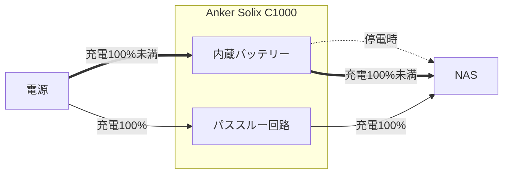

2年ほど前 (2023/4) からデータ管理にNASを使っている。運用も安定しているし次のハードウェアに乗り換える予定があるので今の構成や導入背景をまとめておく。

# NASを導入する

## SSDを使ったデータ管理の問題点

データの保存に外付けSSDを使うことが一般的に増えてきたように思う。一眼での写真や動画を趣味にしていると2つ以上のSSDを持っているという人もいるはずだ。データというものは基本的には消すことがないので、日を追うごとにデータが線形に増え常にSSDを買い足していく必要がある。自分も同じようにSSDの容量が足りなくなるたびに買い足していた。

買い足せば容量問題は消えるが今度は逆に複数のSSDを持っていると例えば1年前に撮った写真はどこにあるか？といった、"どのデータをどのSSDに保存したかわからなくなる問題" や "SSDを跨いだ検索などがしづらい問題" が出てくる。また、複数所有しているとその分だけ紛失や故障の問題を抱えることになる。また、SSDに保存したデータは1つしかないので定期的に複製を作らないとデータのバックアップができていない問題もある。

このようにSSDを使ったデータ管理にはそれなりに問題があり、時間が経てば経つほど (データが増えれば増えるほど) 問題も大きくなるしなんとかしたいと思っていた。

## NASとは

そこでNASを組んでそれらを解決することにした。NASとはネットワークに繋がったHDD (Network Attached Storage) のことで、iCloud DriveとかGoogle Driveみたいな自分専用のクラウドストレージとして機能する。複数のHDDを1つの記憶媒体として認識してくれるためどのHDDにどのデータが入っているか？を意識する必要はない。また、空き容量が減ってきたらHDDを買い足してNASのスロットに差し込むことで、空き容量の数字として加算されていくため物理的に扱うHDD数が増えるという問題が起こらない。

ネットワークに繋がっているHDDなので家からはもちろん、VPNを通して家の外からもアクセスできる。iPhone/iPad、Mac/WindowsなどデバイスやOSを問わずデータにアクセスできるし、通常のフォルダを開く感覚でFinderからアクセスできる[^mount]。外付けSSDのように接続のためにケーブルを抜き差しする手間も必要ない。Google Driveと同じように使えるのにデータ自体は自宅のHDDに置くことができる。他所に預けなくてよい。中を見られているかもという心配やサービスの終了に怯えなくてよいという安心感もある。冗長化は専用のアプリ (提供元による) があってデータの書き込みをミラーリングして前日との差分をバックアップもできる。また、VPSのようにSSH接続でマシンに入ってLinuxコマンドを使ったファイル操作をしたりアプリケーションのインストールができる。

## Synology DS220+



最初のNASには[Synology DS220+](https://global.download.synology.com/download/Document/Hardware/DataSheet/DiskStation/20-year/DS220+/jpn/Synology_DS220_Plus_Data_Sheet_jpn.pdf)を選んだ。[Synology](https://www.synology.com/ja-jp)は台湾の企業で、他にもQNAPなど有名なNASメーカーがあるが、Synologyを選んだのには次のような理由がある。

- 基本ソフトである[DSM](https://www.synology.com/ja-jp/dsm)が直感的で使いやすそうであり開発も盛んである
- [SHR](https://kb.synology.com/ja-jp/DSM/tutorial/What_is_Synology_Hybrid_RAID_SHR)という拡張RAIDの実装がある
- Synology製のアプリがかなり良さそう (Google PhotosみたいなアプリとしてSynology Photosなどがある) 

NASの構築は簡単で本体を買ってHDDを刺すだけ。今回は購入した本体はDS220+といって2ベイのもので、HDDスロットが2つある。これはRAID1 (ミラーリング) などのRAIDタイプに適したベイ数だ。今回はSHRというSynology独自のRAID拡張を選択する[^raid_type]。購入したHDDはWestern DigitalのNAS用ディスク。通常のものでも問題ないようだが、NASは24時間365日稼働しているわけなので専用と謳っているもののほうが信頼性があるかなと思いこちらにした。接続はルーターとNASをLANケーブルで繋ぐ。その後ブラウザから `finds.synology.com` にアクセスすることでLAN内にある同社製品を探すことができる。あとはインストーラーに従って設定していけば良い。

NAS導入後はiPhone、iPad、MacからWi-Fi経由で同じデータにアクセスすることができるようになり、これまでのようにSSDを引っ張り出してきてケーブル刺して、マウントして…といったことがなくなってめちゃくちゃ快適になった。

また、SynologyのNASでは以下のようなことができる。

- 任意のファイルやフォルダの共有リンクを発行する
  - 鍵をかける (パスワード認証)
  - 鍵をかけない (URLを知っている人だけ見れる)
  - 有効期限をつける
- ユーザー管理
  - NASに任意の人を招待し一緒にデータを管理する
  - パーティションは区切ったり権限管理ができる
- 任意のアプリケーションを動かす
  - DSMにあるパッケージマネージャー経由 (App Storeのようなものがある)
    - 例、Google Driveの代替である[Synology Drive](https://www.synology.com/ja-jp/dsm/feature/drive)
    - 例、Google Photosの代替である[Synology Photos](https://www.synology.com/ja-jp/dsm/feature/photos)
  - Docker経由
- サーバ運用
  - 任意のアプリケーションを動かしそのプロセスを動かし続ける
  - 任意のアプリケーションを外からつなぐ

詳しい活用方法、自分のやっていることは下で書く。

# NASを活用する

## 写真を管理する

写真をファイルとして管理するなら他のファイルと同様にフォルダに入れてFinderで触るという形で良い。が、普通は写真はプレビューしたいし、フォルダという括りだけではない写真が持つメタデータ (撮影日時や撮影機材など) でフィルタしたいものだ。SynologyではSynology製のアプリである[Synology Photos](https://www.synology.com/ja-jp/DSM70/SynologyPhotos)がそれをかなえてくれる。



DSMからPhotosを有効にするだけで使える。複数人でのアルバム管理もでき、NASのユーザ管理機能を使って人を追加したあとPhotosに権限を振れば使えるようになる。今は共有領域に置いてフォルダ/タイムライン形式で見れるようにしている。

```bash
/photo       #共有スペース
  2023/
  2024/
/homes
  babarot/   #個人スペース
    Photos/
      2023/
      2024/
```

モバイルアプリもあるので[QuickConnect](https://kb.synology.com/ja-jp/DSM/help/DSM/AdminCenter/connection_quickconnect)を有効にすれば出先からもPhotosにアクセスすることができる。Synology Photosを使った写真管理[^management_photos]というテーマだけでも一つ記事がかけるくらいの良い体験だったのでそれはそれで今後書くかもしれない。

## 自分で書いたWebアプリを動かす

Synology NASではDSMのパッケージマネージャから[Container Manager](https://www.synology.com/ja-jp/dsm/feature/container-manager)というものがインストールできるが要するにDockerである。つまりDockerが動かせるので大抵のソフトウェアを動かすことができる。自分でアプリを書いてDocker化して動かせるし、[compose](https://docs.docker.com/compose/)を使えばDBやキャッシュサーバなどもまとめてNAS上で動かすことができる。

今は自分で撮った旅の動画などを閲覧するU-NEXTのようなアプリを Go + React + SQLite で書きそれをNASで動かしている。旅の思い出など細切れに取った動画データを見返すのはファイル単位だとしづらく、WebアプリのUIで視聴できたほうが楽だなと思いアプリを作り始めた。しかし、いざデプロイとなってもサーバの準備や自分だけが使えれば良いアプリなので、認証の仕組みなどを用意する必要があり面倒だなと思っていたがNASがこれを簡単に解決してくれた。NASだとYouTubeやどこかのクラウドに上げるわけではないので安心してデータを置けるのも良い点だ。

Container Managerアプリからもコンテナの起動や停止ができるがコマンドのほうが慣れているため、NASにsshしてcompose upするスクリプトを書きNAS内からサーバを立ち上げている。

```
$ docker compose up --build -d
```



_※これはデモデータを入れてlocalで立ち上げたアプリのスクショ。_

## 家の外からアクセスする

QuickConnectによるインターネット経由のアクセスも可能だがVPNによる接続も可能だ。

[Tailscale](https://tailscale.com/)とはVPN (Virtual Private Network) 実装のひとつで、これまでのようなHub & Spoke型のVPNのようにTailescaleが接続を取りまとめるのではなくクライアント同士が直接接続されるMesh型のVPNを提供する。このように分散型VPNはVPNサーバを必要としないゆえに中央に負荷がかからない、プライバシーリスクがない、SPoFにならないなどのメリットもある。

Tailscaleはイニシャルにかかるセットアップも少ないところ良い点だ。クライアント同士にTailscaleをインストールしアカウント作成をすればすぐに使い始めることができる。詳しい設定は以下の記事が参考になる。

参考記事:

- [Access Synology NAS from anywhere · Tailscale Docs](https://tailscale.com/kb/1131/synology)
- [Synology NAS に Tailscale を設定する | text.Baldanders.info](https://text.baldanders.info/remark/2021/10/tailscale-with-synology-nas/)

## UPS



NASは24時間365日稼働させておくものである。つまり常時電源 (コンセントなど) に挿しっぱなしになる。ブレーカーが落ちたり停電したりすると電源を喪失するので、データ書き込み中であれば破損する恐れがある。また、立ち上げているサーバのプロセスも死ぬのでやっかいなことが想像つく。

UPSとは無停電電源装置のことであり、電源とNASの間に噛ませるモバイルバッテリーみたいなやつである。通常時はUPS内臓のバッテリーを通さず電源から直接機器側(NAS)に通電するが、電源が落ちた際に数msの一瞬でUPSバッテリーからの電力供給に切り替えてくれて瞬断を防いでくれるというもの。

UPSはそれ専用のものが売られているが今回UPSには[Anker Solix C1000](https://www.ankerjapan.com/pages/solix)を選んだ。Solix C1000はUPSではなくポータブル電源であり、いわば巨大なモバイルバッテリーだ。1056Whの大容量でモバイルバッテリー的な書き方をすると330,000mAh。ACポートの定格出力は家庭用コンセントと同じ1500Wで、基本的な家電をすべて動かすことができる。こいつは災害時に頼もしいのはもちろんだが、なんとこのポータブル電源はUPS機能を持っている[^anker_solix]。
UPSとして専用で売られているものはGraceful Shutdown機能などあるが、NASの場合そういったものは基本的には必要なく瞬断に耐えられる機能さえあれば良かったためこれを選んだ。



満充電時はパススルー回路を通って電力を送るため常時通電による内蔵バッテリーの劣化を防いでくれる。また、この製品は三元系バッテリーではなくリン酸鉄リチウムバッテリーのため安全かつ長寿命であることも選んだ理由だった。

参考記事: [バックアップ電源をUPSからポータブル電源に替えてみる（Anker Solix C1000） – Chase The Core](https://chasethecore.run/%E3%83%90%E3%83%83%E3%82%AF%E3%82%A2%E3%83%83%E3%83%97%E9%9B%BB%E6%BA%90%E3%82%92ups%E3%81%8B%E3%82%89%E3%83%9D%E3%83%BC%E3%82%BF%E3%83%96%E3%83%AB%E9%9B%BB%E6%BA%90%E3%81%AB%E6%9B%BF%E3%81%88/)

## バックアップ

Synologyでは[Hyper Backup](https://www.synology.com/ja-jp/dsm/feature/hyper_backup)というアプリが提供されており次のようなバックアップ体制を簡単につくることができる。

1. 任意のエクスポート先に (例: 別の外付けHDD)
1. 任意の頻度で (例: 毎日)
1. 任意の時間に (例: 0時)
1. 任意の単位で (例: 前日との差分)

NASでRAIDを構成していてもあくまでもNASのバックアップは別で取るべきだ。なぜならRAIDはあくまで耐障害性を高める機能であり、実際に問題が起こってしまった後、つまり完全なデータ喪失やNAS自体の故障による起動障害に対しては無力だからだ。Synologyはこの点においてもぬかりなく便利なアプリを提供してくれているのでありがたい。




# 今後

NASはめちゃくちゃ良い。もっと早く導入すればよかった[^result]。2023年の一番買ってよかったもの、Life Changingだった。

組んで2年弱だが8TBの2台でもSHRだと実効容量は7TBほどしかなくこの2年でいっぱいになってきており今後は容量拡張が必要そうだ。8TBを12TBといった大きいストレージ容量を持つものに換装 (スケールアップ) するか、[DS923+](https://www.synology.com/ja-jp/products/DS923+)といった豊富なベイ数を持ったNASに乗り換えて新規HDDを追加 (スケールアウト) するかが次の課題になっている。



ちなみにDS220+というモデル名は2020年製の2ベイNAS (Disk Station) ということを示している。型番の命名規則は `製品タイプ`+`最大ベイ数`+`リリース年度`+`シリーズ名` になっている[^syno_model]。

- 製品タイプ
  - DS: Disk Station
  - RS: Rack Station
  - FS: Flash Station
- 最大ベイ数
  - DS3622xs+であれば標準で12ベイ、DX1222拡張ユニットを2台使うことで最大36ベイまで拡張できる
- モデル年度 (数字の下2桁)
  - DS923+であれば2023年モデル
  - DS920+であれば2020年モデル
- シリーズ名
  - XS+/XS: エンタープライズ向けモデル
  - Plus: 上級者向けモデル。DS932+とか。末尾に+
  - Value: 通常モデル。DS423とか。末尾に記号なし
  - J: エントリモデル。

<https://www.synology.com/ja-jp/products>

[^mount]: USBメモリのように最初にマウントする必要があるがそれ以降は必要ない
[^raid_type]: RAIDの選択には次の記事が参考になった。[RAID タイプの選択](https://kb.synology.com/ja-jp/DSM/help/DSM/StorageManager/storage_pool_what_is_raid)
[^anker_solix]: 公式にも記載がある: [Anker SOLIX C1000/C1000X Portable Power Station ユーザ ーガイド（A1761）](https://lp.ankerjapan.com/hubfs/aoos/manual/A1761Manual.pdf)
[^result]: そうすれば無駄なSSDに金と時間を入れなくてよかった。NASに移行して抜け殻となった役目のないSSDたちが何個もある…
[^management_photos]: Lightroom Classicで現像してNASに保存、Synology Photosで共有。NASユーザ以外と共有する場合 (例えばイベントの写真など) は外部シェア機能でリンクを知っている人にだけ共有、パスワードを掛けて共有、などもできる
[^syno_model]: [Synology NAS の型番について | ATC構築サービス](https://www.atc.jp/synologynas-modelnumber/)
