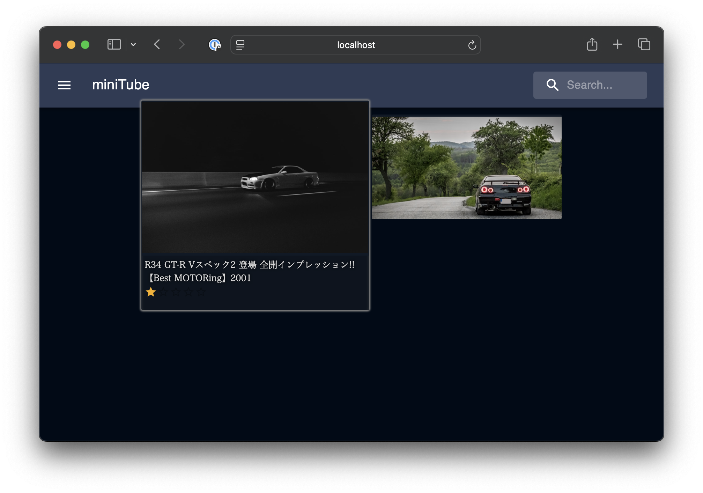
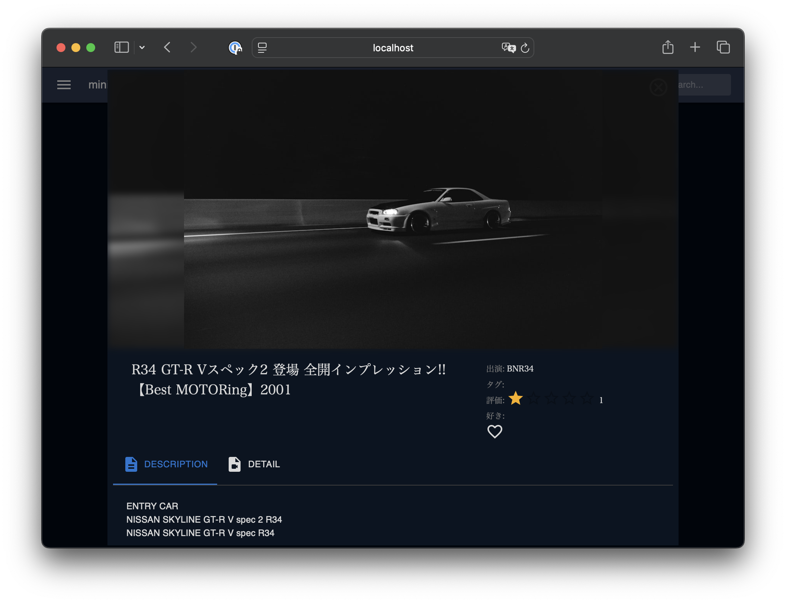
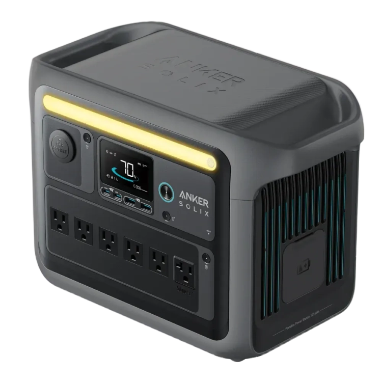
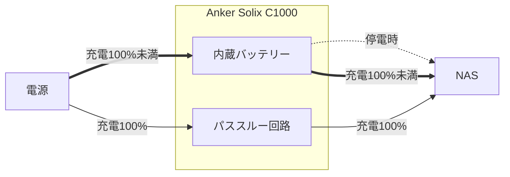
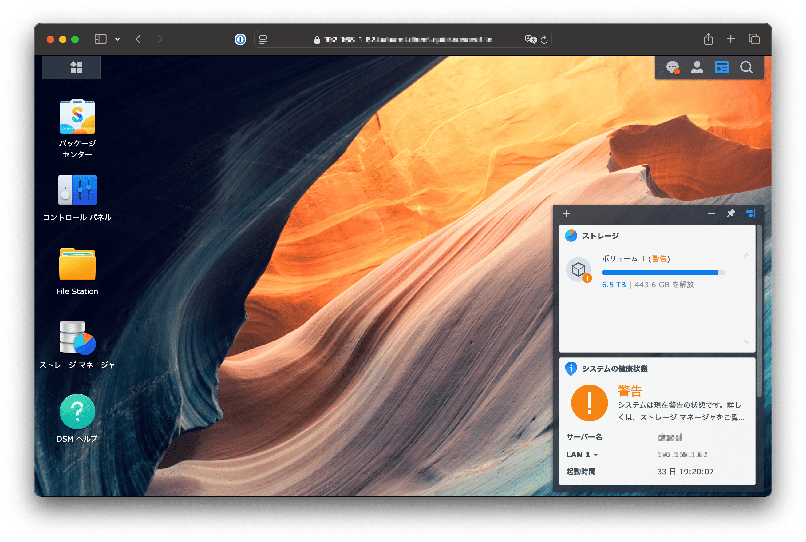

2年ほど前（2023年4月）から、データの管理に NAS を使っている。運用も落ち着いてきたし、次のハードウェアに乗り換える予定もあるので、今の構成と入れた経緯をまとめておく。

# NAS を導入する

## SSD でのデータ管理の不満

データの保存に外付け SSD を使う人は増えてきたように思う。一眼で写真や動画を撮るのが趣味だと、SSD を2つ以上持っている人もいるはず。データは基本的に消さないので、日を追うごとに増え続け、SSD も買い足し続けることになる。自分も、容量が足りなくなるたびに SSD を買い足していた。

買い足せば容量は足りるが、今度は SSD が何本にもなる。すると「1年前に撮った写真はどの SSD だったか」がわからなくなるし、SSD をまたいで探すのも難しい。持っている数だけ、なくしたり壊れたりするおそれも増える。それに、SSD に入れたデータは1つしかないので、自分で複製を作らない限りバックアップがない。

SSD でのデータ管理にはこうした不満があって、データが増えるほど問題も大きくなる。なんとかしたいとずっと思っていた。

## NAS でできること

そこで NAS を組んで、これらを解決することにした。NAS（Network Attached Storage）はネットワークにつながった HDD のことで、iCloud Drive や Google Drive のような、自分専用のクラウドストレージとして使える。複数の HDD を1つの記憶領域として扱ってくれるので、どの HDD にどのデータがあるかを気にしなくていい。空きが減ってきたら HDD を買い足して NAS に差せば、その分が空き容量に足される。手元で扱う HDD の数が増えていくこともない。

ネットワークにつながっているので、家からはもちろん、VPN を通せば外からもアクセスできる。iPhone、iPad、Mac、Windows と、デバイスや OS を問わず使えるし、Mac なら普通のフォルダと同じように Finder から開ける[^mount]。外付け SSD のようにケーブルを抜き差しする手間もない。

Google Drive と同じように使えるのに、データ自体は自宅の HDD に置ける。よそに預けないので、中を見られているかもしれない心配も、サービスが終わる心配もしなくていい。冗長化やバックアップも、メーカーが用意しているアプリで、書き込みのミラーリングや前日との差分のバックアップができる。VPS のように SSH でログインして、Linux のコマンドでファイルを操作したり、アプリケーションを入れたりもできる。

## Synology DS220+

:::img{width=400}

:::

最初の NAS には [Synology DS220+](https://global.download.synology.com/download/Document/Hardware/DataSheet/DiskStation/20-year/DS220+/jpn/Synology_DS220_Plus_Data_Sheet_jpn.pdf) を選んだ。[Synology](https://www.synology.com/ja-jp) は台湾のメーカーで、ほかにも QNAP など有名な NAS メーカーはあるが、Synology にしたのは次の理由から。

- OS にあたる [DSM](https://www.synology.com/ja-jp/dsm) が直感的で使いやすそうで、開発も盛ん
- [SHR](https://kb.synology.com/ja-jp/DSM/tutorial/What_is_Synology_Hybrid_RAID_SHR) という独自の RAID がある
- Synology 製のアプリがよくできていそう（Google Photos のような Synology Photos など）

組むのは簡単で、本体を買って HDD を差すだけ。DS220+ は2ベイのモデルで、HDD のスロットが2つある。RAID1（ミラーリング）のような構成に向いたベイ数で、今回は Synology 独自の SHR を選んだ[^raid_type]。HDD は Western Digital の NAS 用のもの。普通の HDD でも問題はないらしいが、NAS は24時間365日動かし続けるので、NAS 用とうたっているものの方が安心かなと思ってこちらにした。

あとはルーターと NAS を LAN ケーブルでつなぎ、ブラウザで `finds.synology.com` を開くと、LAN の中にある Synology の製品が見つかる。そこからはインストーラーに沿って設定していけばいい。

NAS を入れてからは、iPhone、iPad、Mac から Wi-Fi 越しに同じデータを開けるようになった。SSD を引っ張り出してきてケーブルを差して、マウントして...ということがなくなって、とても快適。

Synology の NAS では、ほかにも次のようなことができる。

- ファイルやフォルダの共有リンクを発行する
  - パスワードをかける
  - パスワードをかけない（URL を知っている人だけが見られる）
  - 有効期限をつける
- ユーザーを管理する
  - 人を招待して、一緒にデータを管理する
  - 領域を分けたり、権限を管理したりする
- アプリケーションを動かす
  - DSM のパッケージマネージャ（App Store のようなもの）から入れる
    - 例: Google Drive の代わりになる [Synology Drive](https://www.synology.com/ja-jp/dsm/feature/drive)
    - 例: Google Photos の代わりになる [Synology Photos](https://www.synology.com/ja-jp/dsm/feature/photos)
  - Docker で動かす
- サーバーとして使う
  - アプリケーションのプロセスを動かし続ける
  - 外からアプリケーションにつなぐ

実際に自分がどう使っているかを、次から書く。

# NAS を活用する

## 写真を管理する

写真もただのファイルとして扱うなら、ほかのファイルと同じようにフォルダに入れて Finder で触ればいい。ただ、写真はプレビューしたいし、フォルダだけでなく、撮影日時や撮影機材のようなメタデータで絞り込みたくもなる。Synology では、Synology 製のアプリの [Synology Photos](https://www.synology.com/ja-jp/DSM70/SynologyPhotos) がそれをかなえてくれる。


DSM から Photos を有効にするだけで使える。複数人でのアルバム管理もでき、NAS のユーザー管理で人を追加して、Photos の権限を渡せばいい。今は写真を共有の領域に置き、フォルダとタイムラインの形で見られるようにしている。

```bash
/photo       # 共有スペース
  2023/
  2024/
/homes
  babarot/   # 個人スペース
    Photos/
      2023/
      2024/
```

モバイルアプリもあるので、[QuickConnect](https://kb.synology.com/ja-jp/DSM/help/DSM/AdminCenter/connection_quickconnect) を有効にすれば出先からも Photos を開ける。Synology Photos での写真管理[^management_photos]は、それだけで1本書けるくらい良い体験だったので、いずれ書くかもしれない。

## 自分で書いた Web アプリを動かす

Synology の NAS では、DSM のパッケージマネージャから [Container Manager](https://www.synology.com/ja-jp/dsm/feature/container-manager) を入れられる。中身は Docker なので、たいていのソフトウェアは動かせる。自分で書いたアプリを Docker にして動かせるし、[compose](https://docs.docker.com/compose/) を使えば DB やキャッシュサーバーもまとめて NAS の上で動かせる。

今は、自分で撮った旅の動画などを見るための、U-NEXT のようなアプリを Go + React + SQLite で書いて、NAS で動かしている。旅の途中で細切れに撮った動画は、ファイルのままだと見返しづらく、Web アプリの UI で見られた方が楽だなと思って作り始めた。ただ、いざデプロイしようとすると、サーバーを用意しないといけないし、自分だけが使うアプリなのに認証の仕組みも必要になる。面倒だなと思っていたところを、NAS がまとめて解決してくれた。YouTube やどこかのクラウドに上げるわけではないので、安心してデータを置けるのも良いところ。

Container Manager のアプリからもコンテナを起動したり止めたりできるが、コマンドの方が慣れているので、NAS に ssh して compose up するスクリプトを書いて、NAS の中でサーバーを立ち上げている。

```
$ docker compose up --build -d
```

:::gallery


:::

_※デモデータを入れて、ローカルで立ち上げたアプリのスクリーンショット。_

## 家の外からアクセスする

QuickConnect でインターネット越しにアクセスすることもできるが、VPN でつなぐこともできる。

[Tailscale](https://tailscale.com/) は VPN（Virtual Private Network）の実装の1つ。これまでの Hub & Spoke 型の VPN のように Tailscale が接続を取りまとめるのではなく、クライアント同士が直接つながる Mesh 型の VPN になっている。VPN サーバーがいらないので、中央に負荷が集まらず、プライバシーの心配もなく、単一障害点（SPoF）にもならない。アカウントを作って、つなぎたい端末に Tailscale を入れるだけで使い始められる。設定もほとんどいらないので、手間も設定漏れも少ない。

Tailscale は P2P なので、Synology の NAS と手元の Mac に Tailscale を入れれば、直接やり取りできるようになる。デバイス名でアクセスできるので、例えば `babarot-nas` と名前をつけておけば、`http://babarot-nas:5000` で NAS の管理画面を開ける。

詳しい設定は次の記事が参考になる。

- [Access Synology NAS from anywhere · Tailscale Docs](https://tailscale.com/kb/1131/synology)
- [Synology NAS に Tailscale を設定する | text.Baldanders.info](https://text.baldanders.info/remark/2021/10/tailscale-with-synology-nas/)

## UPS を使う

:::img{width=300}

:::

NAS は24時間365日動かし続けるものなので、電源にはずっとつなぎっぱなしになる。ブレーカーが落ちたり停電したりすると電源が切れ、書き込みの途中ならデータが壊れるおそれがある。NAS で動かしているサーバーのプロセスも止まってしまうので、なかなか厄介。

UPS（無停電電源装置）は、電源と NAS の間に挟む、モバイルバッテリーのようなもの。ふだんは内蔵のバッテリーを通さずに電源から NAS へ電気を送り、停電したときは数 ms で内蔵バッテリーからの給電に切り替えて、電源が途切れないようにしてくれる。

UPS は専用の製品も売られているが、今回は [Anker Solix C1000](https://www.ankerjapan.com/pages/solix) を選んだ。Solix C1000 は UPS ではなくポータブル電源で、いわば巨大なモバイルバッテリー。容量は1056Wh で、モバイルバッテリーの書き方をすると330,000mAh になる。AC ポートの定格出力は家庭用のコンセントと同じ1500W なので、たいていの家電は動かせる。災害のときに頼りになるのはもちろん、このポータブル電源は UPS の機能も持っている[^anker_solix]。

UPS 専用の製品には Graceful Shutdown のような機能もあるが、NAS には基本的にいらず、瞬断に耐えられれば十分だったので、これにした。


```mermaid
flowchart LR
O[電源]
B[内蔵バッテリー]
N[NAS]
PT[パススルー回路]

O ==> |充電100%未満| B
O -->|充電100%| PT
B -.->|停電時| N
B ==>|充電100%未満| N
subgraph UPS[Anker Solix C1000]
direction LR
B
PT
end
PT-->|充電100%|N
```

満充電のときはパススルー回路を通して電気を送るので、つなぎっぱなしでも内蔵バッテリーが傷みにくい。三元系ではなくリン酸鉄リチウムのバッテリーで、安全で長持ちするのも選んだ理由の1つ。

参考にした記事: [バックアップ電源をUPSからポータブル電源に替えてみる（Anker Solix C1000） – Chase The Core](https://chasethecore.run/%E3%83%90%E3%83%83%E3%82%AF%E3%82%A2%E3%83%83%E3%83%97%E9%9B%BB%E6%BA%90%E3%82%92ups%E3%81%8B%E3%82%89%E3%83%9D%E3%83%BC%E3%82%BF%E3%83%96%E3%83%AB%E9%9B%BB%E6%BA%90%E3%81%AB%E6%9B%BF%E3%81%88/)

## バックアップを取る

Synology には [Hyper Backup](https://www.synology.com/ja-jp/dsm/feature/hyper_backup) というアプリがあって、次のようなバックアップを簡単に組める。

1. 好きなバックアップ先に（例: 別の外付け HDD）
1. 好きな頻度で（例: 毎日）
1. 好きな時間に（例: 0時）
1. 好きな単位で（例: 前日との差分）

NAS で RAID を組んでいても、バックアップは別に取っておいた方がいい。RAID はあくまで障害に強くするための仕組みで、データが丸ごと消えたときや、NAS 自体が壊れて起動しなくなったときには役に立たない。このあたりも Synology はアプリで面倒を見てくれるのがありがたい。

:::img{width=400}

:::

# 今後

NAS はとても良い。もっと早く入れればよかった[^result]。2023年に買ってよかったものの中でも一番で、生活が変わるくらいだった。

もちろん課題もある。組んで2年弱で、8TB の HDD 2台でも SHR だと実効容量は7TB ほどしかなく、この2年でいっぱいになってきた。容量を増やすには、8TB を12TB のような大きい HDD に換装する（スケールアップ）か、[DS923+](https://www.synology.com/ja-jp/products/DS923+) のようなベイ数の多い NAS に乗り換えて HDD を足す（スケールアウト）か。どちらにするかが次の課題になっている。



ちなみに、DS220+ という型番は、2020年製の2ベイの NAS（Disk Station）を表している。型番は `製品タイプ` + `最大ベイ数` + `モデル年度` + `シリーズ名` で決まっている[^syno_model]。

- 製品タイプ
  - DS: Disk Station
  - RS: Rack Station
  - FS: Flash Station
- 最大ベイ数
  - DS3622xs+ なら標準で12ベイ、DX1222 拡張ユニットを2台つなぐと最大36ベイ
- モデル年度（数字の下2桁）
  - DS923+ なら2023年モデル
  - DS920+ なら2020年モデル
- シリーズ名
  - XS+ / XS: エンタープライズ向け
  - Plus: 上級者向け。DS923+ など、末尾に +
  - Value: 通常のモデル。DS423 など、末尾に記号なし
  - J: エントリーモデル

<https://www.synology.com/ja-jp/products>

[^mount]: USB メモリのように最初にマウントする必要はあるが、それ以降はいらない。
[^raid_type]: RAID の選び方は、[RAID タイプの選択](https://kb.synology.com/ja-jp/DSM/help/DSM/StorageManager/storage_pool_what_is_raid)が参考になった。
[^anker_solix]: 公式にも書いてある: [Anker SOLIX C1000/C1000X Portable Power Station ユーザーガイド（A1761）](https://lp.ankerjapan.com/hubfs/aoos/manual/A1761Manual.pdf)
[^result]: そうすれば、余計な SSD にお金と時間をかけずに済んだ。NAS に移したあと、役目を終えた SSD が何本も残っている...
[^management_photos]: Lightroom Classic で現像して NAS に保存し、Synology Photos で共有している。NAS のユーザー以外と共有するとき（イベントの写真など）は、外部共有の機能で、リンクを知っている人にだけ見せたり、パスワードをかけたりもできる。
[^syno_model]: [Synology NAS の型番について | ATC構築サービス](https://www.atc.jp/synologynas-modelnumber/)
