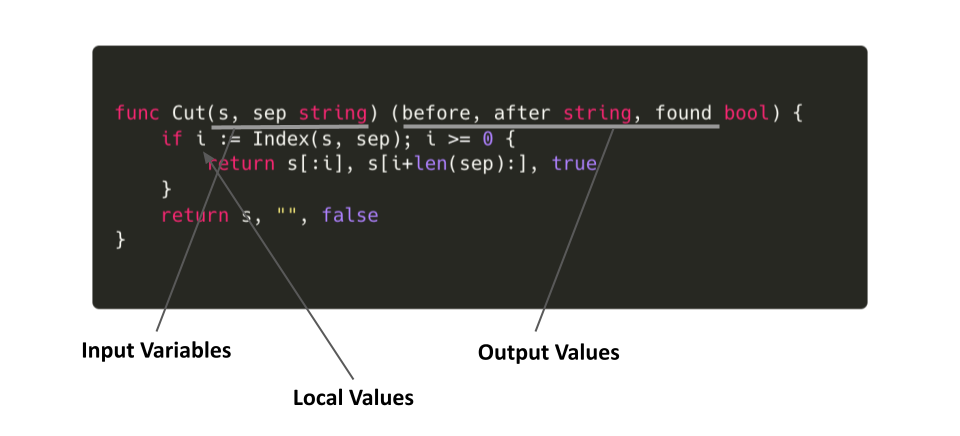
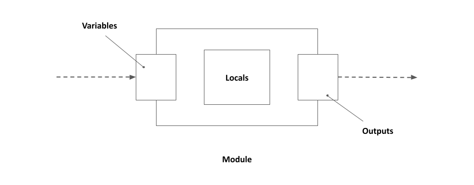

## それぞれの役割

Terraform で "変数" というと、[Variables](https://www.terraform.io/language/values/variables) と [Locals](https://www.terraform.io/language/values/locals) がある。どちらも値を入れて、Terraform ファイル や [Terraform Module](https://www.terraform.io/language/modules/syntax) から参照することができる。ちなみに Terraform Module とは「`.tf` ファイルが置かれたディレクトリ」を意味する。main.tf などを置いた瞬間からそのディレクトリは Module として扱われ、起点となる Module を Root Module と呼ぶ。

Terraform では "変数" 以外に "返り値" (Return value) に相当するものとして [Outputs](https://www.terraform.io/language/values/outputs) がある。これは Module での処理結果を Module 外から参照できるようにするために使うものである。

それぞれについて公式ドキュメントでは次のように紹介されている。

- Input Variables serve as parameters for a Terraform module, so users can customize behavior without editing the source.
- Output Values are like return values for a Terraform module.
- Local Values are a convenience feature for assigning a short name to an expression.

[Variables and Outputs | Terraform by HashiCorp](https://www.terraform.io/language/values)

要約すると次のように考えられる。もちろん、ここで指している "Terraform module" とは Root Module (main.tf を置いただけのディレクトリ) についても含んでいる。

- Variables は Terraform module のパラメータであり、tf ファイルを変更することなく module の挙動を変えることができるもの
- Outputs は Terraform module の返り値
- Locals は式に別名を付けるための便利なもの

それぞれの役割をプログラミング言語に例えるとイメージしやすいかもしれない。



そうすると、関数の中身を Module と捉えることができ、Locals はローカル変数であるといえる。

## Variables と Outputs は API

Variables は「ユーザが Module のコードを変更することなく Module の挙動を変えるためのパラメータ」であるとわかった。

次のような variable の定義があったとする。

```hcl
variable "enable_xxx_feature" {
  description = "Enable XXX"

  type    = bool
  default = false
}
```

このとき、Module 側の resource 定義で `var.enable_xxx_feature` の値を見て [true/false によって作成の有無を判断する](https://tellme.tokyo/post/2022/06/12/terraform-count-for-each/) ("count を使うとき" 参照) ようになっていた場合、コードを変更することなく外部から Module の挙動を変えることができる。

上のような Bool のフラグ以外にも、

```hcl
variable "service_name" {
  type = string
}
```

このような variable についても、外部から `service_name` を与えその値によって作られるリソース名が変わることを考えると「コードを変更することなく外部から Module で作られるリソースの名前を変えるためのパラメータ」であるといえる。

ちなみに [default](https://www.terraform.io/language/values/variables#default-values) を設定しない場合、terraform コマンドの実行時にプロンプト経由で必ず聞かれる (引数で渡した場合はその値が使用される)。

```console
$ terraform plan -var="service_name=myservice"

No changes. Your infrastructure matches the configuration.

Terraform has compared your real infrastructure against your configuration and found no differences, so no changes are needed.
```

```console
$ terraform plan
var.service_name
  Enter a value: _
```

また、Variables では [validation](https://www.terraform.io/language/values/variables#custom-validation-rules) を設定することができる。これは「ユーザからの入力を期待する」Variable ならではの Argument である。ちなみにユーザによって値をオーバーライドされない Locals にはこの機能はない。

```hcl
variable "gcp_project_id" {
  type = string

  validation {
    condition     = length(var.gcp_project_id) < 30
    error_message = "Length of GCP project ID should be less than 30 (GCP limitation)."
  }
}
```
```console
$ terraform plan
var.gcp_project_id
  Enter a value: too-long-long-long-long-project-id

╷
│ Error: Invalid value for variable
│
│   on variable.tf line 1:
│    1: variable "gcp_project_id" {
│     ├────────────────
│     │ var.gcp_project_id is "too-long-long-long-long-project-id"
│
│ Length of GCP project ID should be less than 30 (GCP limitation).
│
│ This was checked by the validation rule at variable.tf:4,3-13.
╵
```

このように Variables はユーザに一番近いレイヤであり、インターフェイスである。常に値をオーバーライドされる可能性がある。

同様に Outputs にも同じことがいえる。

```hcl
output "id" {
  value = format("myservice-%s-prod", var.gcp_project_id)
}
```

```console
$ terraform plan
var.gcp_project_id
  Enter a value: babarot-pricing

Changes to Outputs:
  + id = "myservice-babarot-pricing-prod"

You can apply this plan to save these new output values to the Terraform state, without changing any real infrastructure.
```

Variables と Outputs はユーザに公開されたインターフェイスであり、API と同様の性質を持つ。一度公開すると簡単には変更できず削除できない。どのような Input として Variables を定義し、どのような Output をすべきかを考えて Outputs を定義する必要がある。



## どのような API を定義するべきか

ではどのような Variables や Outputs を API として考えるべきか。

Module を定義して外部に公開する場合 (ここでいう外部とは Module 管理者以外を指し必ずしもインターネットで公開することを意味しない) 常にどんなインターフェイスにするべきかを考える必要がある。一度公開し、ひとたび参照されてしまうと、うかつに削除することができなくなる。

Module のインターフェイスを考えるために、「サービスの立ち上げに必要なツールセットを作成する Module」(名前を service-kit とする) があったとする。

サービスの立ち上げ時に必要なもの:

- GCP (Project / Firebase / GCS Bucket / IAM / ...)
- GitHub Team
- PagerDuty (Service / Team / Escalation Policy / Schedule)
- Datadog (Monitor / Alert)
- Slack (mention group / channel)
- ...

まずはじめに、それぞれの機能 (GCP など) を有効にするかどうかを variable `enable_xxx` として定義することが考えられる。サービスによっては例えば PagerDuty を必要としたりしなかったりが想定できるからである。また、PagerDuty の基本的な設定はするが [Schedule](https://support.pagerduty.com/docs/schedule-examples) (OnCall Shift) の機能だけ使わないことも (公開する範囲内では) 一般的なユースケースだったとする。その場合もそれだけを無効にしたりと外部から変更できるようになっていると嬉しい。

```hcl
# モジュール側
variable "pagerduty" {
  description = "PagerDuty configurations"

  type = object({
    enable          = bool
    create_schedule = bool
  })
  default = {
    enable          = false
    create_schedule = false
  }
}
```

こうすることで、ユーザのユースケースに応じて Module の振る舞いを変更できる余地をユーザに与えることができる。このとき提供する機能はデフォルトでオフになっていることが好ましい。

```hcl
# ユーザ側
module "myservice" {
  source = "git://..."

  # PagerDuty の機能は使うが、Schedule (OnCall Shift) だけは作らない
  pagerduty = {
    enable          = true
    create_schedule = false
  }
}
```

一方で、良くないインターフェイスは何かを考えてみる。

例えば次のような variable を定義したとする。GCP プロジェクトを作成したときに紐付ける Billing account の設定である。

```hcl
# モジュール側
variable "billing_account" {
  type    = string
  default = "01234-ABCDEF-56789"
}
```

何度もいうように Variables は API であり常にユーザに公開されている。つまりユーザはこの値を変更することができる。入力として正しくないものを弾く場合は validation を設定することで Input を制御することができるが、"正しい Billing account かどうか" を Module で判断するのは難しい。こういったものは Variables として定義するべきではない。Locals に置くことを考えるべきである。仮に作成する GCP プロジェクトごとに Billing account をユーザが変更できるようにするのであれば、Locals (ユーザが変更できない場所) で定義した値を選択させるようなインターフェイスにするべきである。

```hcl
# モジュール側
variable "gcp_billing_account" {
  type    = string
  default = "account-a"

  validation {
    condition     = contains(["account-a", "account-b", "account-c"], var.gcp_billing_account)
    error_message = "Not allowed billing account."
  }
}

locals {
  billing_accounts = {
    account-a = "01234-ABCDEF-56789-A"
    account-b = "01234-ABCDEF-56789-B"
    account-c = "01234-ABCDEF-56789-C"
  }
}

resource "google_project" "service" {
  count = var.enable_gcp ? 1 : 0

  name       = var.gcp_project_id
  project_id = var.gcp_project_id

  billing_account = local.billing_accounts[var.gcp_billing_account]
}
```

```hcl
# ユーザ側
module "myservice" {
  source = "git://..."

  # ユーザはどの Billing account を使うか選ぶだけ
  gcp_billing_account = "account-a"
}
```

こうすることでユーザは紐付けたい Billing account を選んだ上で安全に Module に渡すことができ、Module としても予期せぬ文字列を受け取らないようにすることができる。
このように、ユーザに隠したい変数は可能な限り Locals に定義するべきである。Variables に定義するとユーザが変更できてしまうこと忘れてはいけない。

## Outputs のインターフェイスを考える

Variables の例でもわかったように公開するべきものは慎重に選ぶ必要がある。Outputs についても同様で、常にユーザに参照されることを考慮するべきである。ではどんな Outputs を定義するべきか。

PagerDuty を例に考えてみる。上でも説明したとおり、使いたい機能を選べるように Input Variables が定義されているとする。Module 内で作成するリソースについては多少の挙動を変更できる余地を残した上で可能な限り隠蔽する。こうすることでユーザに余分な選択を与えないようにできる。逆に多くのものの挙動を Module 外から操作できるように Variables を事細かく定義してユーザに公開する場合、それはインターフェイスとして優れておらず、そもそもそのリソースは Module 内に閉じ込めないほうがいいと考えられる。

良くない隠蔽の仕方:

(これほどユーザに設定させる必要があるリソースは Module にいれるべきではない可能性が高い)

```hcl
# モジュール側
variable "pagerduty" {
  description = "PagerDuty configurations"

  type = object({
    enable  = bool
    service = object({
      support_hours = object({
        type         = string
        time_zome    = string
        start_time   = string
        end_time     = string
        days_of_week = list(string)
      })
      ...
    })
    ...
  })
  default = {
    enable  = false
    service = {
      support_hours = {
        type         = "fixed_time_per_day"
        time_zone    = "America/Lima"
        start_time   = "09:00:00"
        end_time     = "17:00:00"
        days_of_week = [1, 2, 3, 4, 5]
      }
      ...
    }
    ...
  }
}
```

Module とは抽象度を上げるためのものであるのにも関わらず、これほどまで多くの項目を Variables に定義して Module 外部から変更できるようにする場合、それは Module に含めるリソースであるのかどうかを改めて考える必要がある。
こうしたリソースを Module に入れない場合、ユーザが自分たちで定義する必要が出てくる。そのとき、Module 内で作成したリソースやデータとやりとりをするためのブリッヂになるのが Outputs である。

以下のリソースが service-kit module で定義されており、

```console
$ ls  modules/service-kit/pagerduty_*
pagerduty_escalation_policy.tf
pagerduty_schedule.tf
pagerduty_service.tf
pagerduty_user.tf
```

以下のリソースが Root Module (ユーザ側: service-kit の呼び出し元) にあるとする。

```console
$ ls
pagerduty_ruleset.tf
pagerduty_ruleset_rule.tf
```

PagerDuty RuleSet (pagerduty_ruleset.tf) は Module 側で定義されておらず (設定項目がユーザに依存しすぎて抽象化できなかったとする)、ユーザが自身で定義する必要がある。

[pagerduty_ruleset_rule](https://registry.terraform.io/providers/PagerDuty/pagerduty/latest/docs/resources/ruleset_rule#route) では PagerDuty Service の Service ID を参照する箇所がある。PagerDuty Service (pagerduty_service.tf) は Module 側に定義されており、ユーザは参照することができない。しかし、Service ID をハードコードするのではなく、リソース参照により取得したいと考える。

このようなユースケースでは [pagerduty_service.*.id](https://registry.terraform.io/providers/PagerDuty/pagerduty/latest/docs/resources/service#id) は Outputs として公開するべきといえる。

```hcl
# モジュール側
output "pagerduty_service_id" {
  value = pagerduty_service.service.id
}
```

こうすることでユーザは自分で定義した pagerduty_ruleset_rule から参照することができる。

```hcl
# ユーザ側
resource "pagerduty_ruleset_rule" "service" {
  ruleset  = data.pagerduty_ruleset.default_global.id
  ...
  actions {
    route {
      value = module.myservice.pagerduty_service_id # "AB1C23D" のような値を書かなくて良い
    }
  }
  ...
}
```

State から見ても Module 側とユーザ側で分離されていることがわかる。ここのブリッヂになるのが Outputs である。

```console
$ teraform state list
data.pagerduty_ruleset.default_global
pagerduty_ruleset_rule.service          ---------------reference--------\
module.myservice.data.pagerduty_user.oncall_members["babarot@xxx.com"]   |
module.myservice.pagerduty_escalation_policy.service                     |
module.myservice.pagerduty_service.service   <---------(output)---------/
...
```

## Root Module の場合は Variables を使うか、Locals を使うか

Root Module とはユーザが .tf ファイルを置いたディレクトリである。Module 外から振る舞いの変更や Outputs が参照される可能性が低い。

おそらく Terraform のユースケースとして Root Module が一番多いため、Locals を使うか Variables を使うか曖昧になっているケースが多いと感じる。Root Module では Token の設定など Git 管理できないものなどを外から注入するユースケースを除き、Module での考えと同じように Locals を優先して使って問題ない。

```hcl
# ユーザ側
variable "pagerduty_token" {
  description = "PagerDuty token"
}
```

(variable の default を書かないことで Git に含めないで環境変数やプロンプト経由で Terraform に渡すことができる)

## まとめ

- Variables は API である。公開するものは常にユーザによって上書きされる可能性がある
- Variables は多くを定義しないほうが良い。定義が多い場合、ユーザに選択させすぎている良くないインターフェイスかもしれない
- Module 内部に閉じ込めておきたい変数は Locals に書く。必然的に Locals での定義が一番多くなるべきである
- Outputs も多くを定義しない。Variables 同様に API としての側面を持つ。Module 内と外をつなぐブリッヂとして必要なユースケースが考えられる場合のみ定義する
- 公開した API (Variables / Outputs) は変更が難しい。変えたい場合は Versioning をして Module の Release note などで破壊的変更があることをユーザに知らせる必要がある
